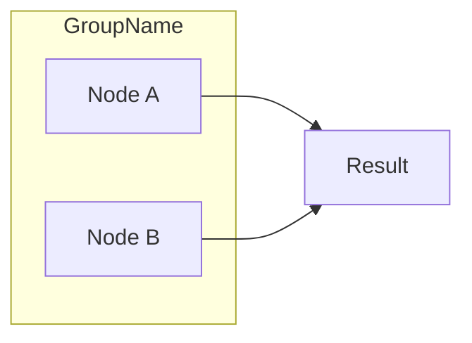
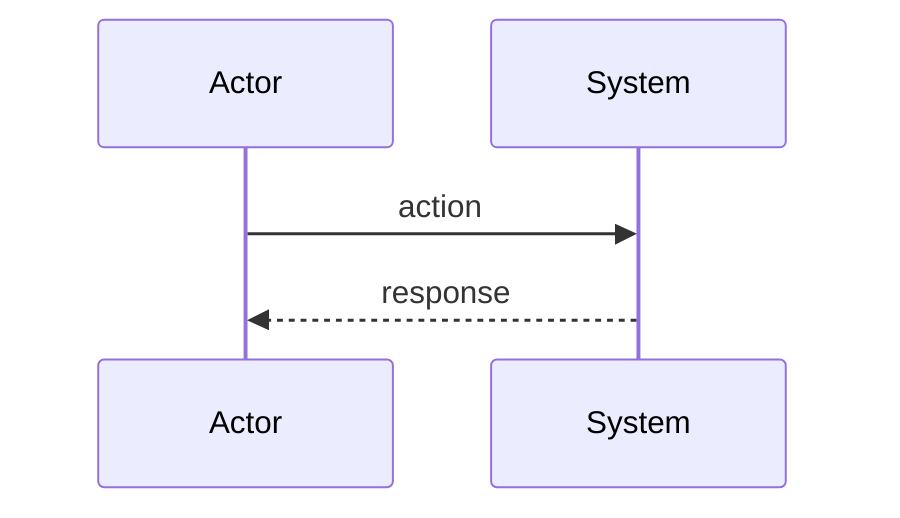
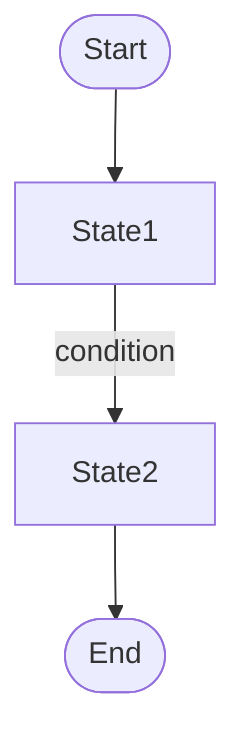
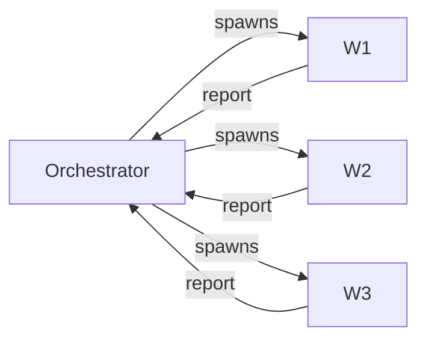
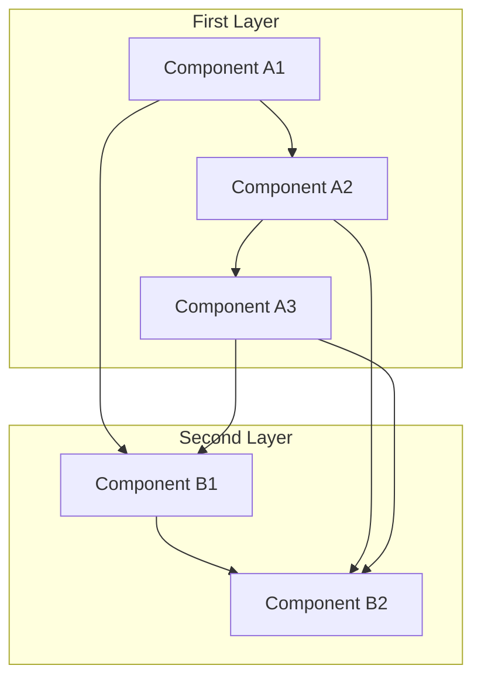

# Blog Mermaid Diagrams

Create mermaid diagrams that match the blog's visual theme.

## Color Theme

The blog uses **sky** as primary and **zinc** as neutral colors.

| Element          | Light Mode | Dark Mode |
| ---------------- | ---------- | --------- |
| Background       | white      | #020618   |
| Primary fill     | sky-100    | sky-900   |
| Secondary fill   | zinc-100   | zinc-800  |
| Borders/lines    | sky-600    | sky-500   |
| Text             | zinc-900   | zinc-100  |
| Accent/highlight | sky-400    | sky-400   |

## Diagram Style Guidelines

1. **Keep it simple** - Prefer fewer nodes with clear relationships
2. **Use horizontal layouts** - `flowchart LR` reads better than `TB` for most cases
3. **Group related items** - Use subgraphs to cluster concepts
4. **Consolidate arrows** - Use `&` syntax: `A & B & C --> D`
5. **Minimal labels** - Edge labels should be 1-3 words max

## Flowchart Template

## Sequence Diagram Template

## State Diagram Alternative

Prefer flowcharts over state diagrams - they render more reliably:

## Examples

### Good: Simple and clear

### Bad: Over-complicated

Simplify to essential relationships only.
