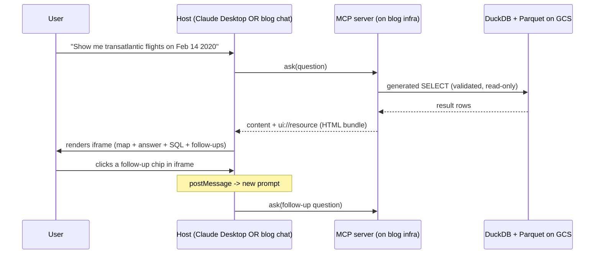

# MCP UI in Chat: Render Rich UI and Ask Questions of Aviation Data

## Problem Frame

Chris wants a portfolio-grade demo of what's newly possible with MCP Apps (SEP-1865, Jan 2026), hosted on his personal blog. The artifact has two pieces serving different audiences:

- **Live demo — primary audience: cold blog visitors.** Developers landing with no context. They must understand what the demo does and why it's useful within ~5 seconds, without reading docs. Design the iframe surface for this audience: map-viz hero, answer-first, SQL collapsed by default.
- **Companion blog post — primary audience: technical/aerospace peers.** GE data-platform colleagues, hiring managers, MCP-curious engineers. The post carries the architecture story: the bidirectional UI contract, the lakehouse-scale path (Iceberg when this grows up), the SQL safety model, the chart auto-selection heuristic. Readers who want depth find it in the post; the live demo does not carry that load.

Beyond "impressive," this is a resume/portfolio piece. The demo is the hook; the post is the depth. Neither on its own is the portfolio piece.

The hardest constraint is that the same MCP server must render identically in **both Claude Desktop** (via MCP Apps iframes) **and the blog's own AI chat**. The blog's chat is already an MCP client — it uses `@anthropic-ai/claude-agent-sdk` with an in-process MCP server at `packages/blog/server/utils/ai/tools/index.ts` (via `createSdkMcpServer`), wired into the agent loop in `packages/blog/server/utils/ai/agent.ts`. So the new work is narrower than "teach the chat MCP": it's **(a)** add a remote Streamable HTTP MCP client alongside the existing in-process one, and **(b)** render `ui://` resources as sandboxed iframes in the Nuxt chat UI. This bidirectional UI contract — one MCP server, two host surfaces — is intentionally the rarest technical story in the stack and the centerpiece of the blog post.

## Requirements

**Demo Experience**

- R1. A user can type (or click a starter question for) a natural-language question and receive a plain-English answer plus an auto-selected visualization.
- R2. First-time users see a curated set of 6-10 starter questions so they never face a blank input box.
- R3. Every answer includes a collapsible "show SQL" section so technical viewers can inspect the generated query.
- R4. Every answer surfaces 2-3 clickable follow-up questions that extend the exploration thread.
- R5. The visualization layer auto-selects a chart type from the SQL result shape: geographic queries render as an interactive route/airport map, rankings as bar charts, time series as line charts, and ties/small result sets fall back to tables.
- R6. A cold visitor can get a useful, visual answer within 5 seconds of opening the iframe, without reading any documentation.

**Bidirectional Rendering**

- R7. One MCP tool call produces one iframe UI that renders identically in Claude Desktop (consuming the MCP Apps extension) and in the blog's AI chat surface.
- R8. The blog's AI chat at `packages/blog/app/pages/chat/` is extended to (a) consume a remote Streamable HTTP MCP server alongside its existing in-process MCP server (`createSdkMcpServer` in `packages/blog/server/utils/ai/tools/index.ts`) and (b) render `ui://` resources as sandboxed iframes the same way Claude Desktop does.
- R9. When a user clicks a follow-up question inside the iframe, the click reaches the enclosing host (Claude Desktop or blog chat) as a new prompt — via a single `postMessage` contract that both hosts implement.

**Data & Query Layer**

- R10. Queries run against static Parquet files in GCS, read directly by DuckDB — no Iceberg catalog, no query cluster. Iceberg is explicitly deferred; the blog post discusses it as the production-scale path.
- R11. The dataset is aviation-themed: **OpenFlights** (ODbL + attribution) for global dimensions (airports, airlines, routes) joined with **BTS T-100 / On-Time Performance** (US DOT, public domain under 17 USC §105) as the fact table (US flight segments with carrier, origin, destination, distance, delays, cancellations). Scope: US-only flights for facts; global reference data for dims. Pivoted from an original OpenSky Network design after license research confirmed OpenSky's free tier excludes personal-blog redistribution.
- R12. DuckDB runs in read-only mode via the connection flag. The SQL safety layer additionally rejects the DuckDB-specific surface the read-only flag does not cover: `ATTACH`, `INSTALL`, `LOAD`, `PRAGMA`, `CALL`, `SET`, `COPY TO`, extension auto-load, and local-filesystem reads. Violations are blocked before execution with a clear error.
- R13. SQL is validated against the known schema before running. Malformed or off-schema queries return an actionable error with a suggested rephrasing rather than failing silently.
- R14. Query execution happens inside the MCP server process via DuckDB reading Parquet from GCS — no external query cluster, no Iceberg extension.

**Portfolio Artifact**

- R15. The MCP server is deployed as part of the blog's own infrastructure and is reachable remotely by any Claude Desktop user from the public internet.
- R16. A public blog post ships alongside the demo and explains: the bidirectional MCP Apps UI contract across two hosts, the Parquet-on-GCS + DuckDB stack (with Iceberg discussed as the production-scale path), the SQL safety model against LLM-generated queries, and the chart auto-selection heuristic.
- R17. The blog renders clear, copy-pasteable "Add to Claude Desktop" instructions. A developer can wire the server into Claude Desktop in under 2 minutes.

## Success Criteria

- **Primary:** A cold visitor clicks a starter question and sees a map or chart within 5 seconds — no docs, no setup, no explanation required. The iframe is self-explanatory.
- **Primary:** The companion blog post gets cited or linked by at least one external source (not a retweet — an actual reference) within 6 months. Captures the "it resonated with peers" signal without being HN-contingent.
- A developer with Claude Desktop already installed adds the MCP server in under 2 minutes using only the blog's instructions (precondition: current Claude Desktop).
- The live demo still works 12 months after launch; if the MCP Apps spec breaks the iframe contract, the blog post remains the durable artifact. (Shelf-life target relaxed from 2 years: the centerpiece is pinned to a 3-month-old spec; hardening for 2 years is not credible without versioning commitments that aren't justified for this scope.)

## Scope Boundaries

- Not a general-purpose BI tool — the dataset is curated and fixed.
- Not write-enabled — SELECT-only queries, enforced pre-execution.
- Not a wrapper around the blog's existing workflow engine. (Considered and rejected during brainstorm — demo quality would inherit the ceiling of the workflow templates.)
- Not multi-dataset at launch — one aviation dataset is sufficient for the portfolio goal.
- No authentication for blog visitors — public. Abuse posture is "hard cost cap, soft traffic controls": the blog's GCP project has a $10 spend cap that auto-stops if exceeded, so worst-case DoS takes the demo temporarily offline rather than running up a bill. Per-query DuckDB timeout/memory-cap and basic per-IP request throttling are still wanted as a usability floor (one bad actor shouldn't brick the demo for everyone else), but belt-and-suspenders abuse controls are out of scope.
- No persistent session/history per visitor — every question is stateless.
- Not real-time — BTS T-100 is loaded as a historical snapshot (BTS publishes monthly with a few months' lag anyway).

### Deferred to Separate Tasks

- Live flight-tracking integration (OpenSky with a license, ADS-B Exchange, or OpenSky's free live REST API for a bounded demo) — possible v2 blog post that brings back the "watch planes in the air right now" wow factor.
- "Book time with Chris" / real-calendar MCP demo — a sibling portfolio piece explored during brainstorm; not bundled with this launch.
- Additional datasets (GitHub Archive, NYC Taxi) — could extend the demo later with a dataset switcher.

## Key Decisions

- **Decoupled from the existing workflow engine.** Demo quality should not depend on how good the seeded workflow templates are; the Q&A story stands on its own.
- **Aviation dataset (OpenFlights dims + BTS T-100 facts).** Targets the GE aerospace audience (BTS is the dataset aerospace analysts actually use) and makes map visualization the hero visual. Facts + dims shape. OpenSky rejected on license grounds; BTS is US public domain with zero redistribution friction.
- **Parquet on GCS, not Iceberg.** The demo surface does not expose Iceberg-specific behavior (time travel, schema evolution are invisible to visitors), so paying the catalog-setup and extension-stability cost buys narrative only. The blog post explicitly addresses Iceberg as the production-scale path ("how this would extend to a real lakehouse").
- **Bidirectional rendering is the sole centerpiece.** One MCP server, two host surfaces (Claude Desktop via MCP Apps iframes + blog chat as a same-protocol host). The aviation data is the vehicle. The blog's chat is already MCP-based (via `@anthropic-ai/claude-agent-sdk`), so the marginal work is "add remote Streamable HTTP client + iframe rendering," not a greenfield host.
- **Charts auto-selected from result shape.** Preserves the 5-second legibility bar. Auto-selection heuristic becomes a blog-post section.
- **Ship a demo and a blog post as one artifact.** Neither on its own is the portfolio piece; the pair is.

## Dependencies / Assumptions

- The blog's existing AI chat can be extended to consume a remote Streamable HTTP MCP server and render `ui://` resources in sandboxed iframes. The chat is already an MCP client (via `@anthropic-ai/claude-agent-sdk` + `createSdkMcpServer`), so the extension is narrower than a greenfield host — but the exact integration path (run the remote server alongside the in-process one, or replace it) is a planning decision.
- Claude Desktop's MCP Apps postMessage contract is reproducible in a non-Claude-Desktop host with acceptable fidelity. **Unverified and load-bearing for the centerpiece** — a pre-commitment spike is required before architecture work begins.
- The blog's GCP infrastructure can host Parquet files in GCS and serve a DuckDB-based query endpoint from the same Cloud Run deployment (or a sibling service). Consistent with existing deploy scripts, but the exact topology is a planning decision.
- **Licenses confirmed (2026-04-14):** BTS T-100 is US government public domain (fully redistributable). OpenFlights is ODbL — attribution is required; share-alike only triggers if Chris publishes the derivative database publicly (which he won't — Parquet files live behind the MCP server, only query results are returned to users). No license-gate risk remains.

## High-Level Technical Direction

The stack choice is part of the product decision (bidirectional-rendering is the centerpiece, so transport and iframe contract are captured here rather than left for planning):

- **Storage:** Parquet files in GCS, written once by a one-shot ETL script from OpenFlights CSVs (for dims) and BTS T-100 monthly CSV releases (for facts). No Iceberg catalog.
- **Query engine:** DuckDB embedded in the MCP server process, reading Parquet directly from GCS via `httpfs`/`gcs` support. Opened in read-only mode. Extension auto-load disabled.
- **Server transport:** Streamable HTTP (remote-accessible from Claude Desktop), co-hosted with the blog on GCP.
- **UI:** single HTML bundle served from a `ui://` resource, uses a lightweight map library (e.g., Leaflet) + a chart library. No iframe-side framework — keeps the bundle under the MCP Apps payload cap. Specific libraries pinned in planning after a size spike.
- **Host-iframe protocol:** one `postMessage` contract for follow-up clicks, schema links, and status. Claude Desktop's MCP Apps protocol is the reference; the blog chat implements the same contract as a same-protocol host (not a "compatible subset"). Origin validation enforced in both directions.

### Bidirectional rendering — sequence sketch

## Outstanding Questions

### Deferred to Planning

- [Affects R7, R8][Technical] Exactly how does the blog's current AI chat map onto an MCP host role? Does it spawn an MCP client via stdio locally, consume Streamable HTTP, or embed the tool-call loop and treat the MCP server as a library? The choice affects how much of the blog's existing `tools.ts` architecture survives.
- [Affects R10, R14][Needs research] Realistic query latencies for DuckDB reading Parquet directly from GCS (via `httpfs`) against ~15M-row BTS tables. Spike early so the 5s success criterion stays credible.
- [Affects R11][Planning] Which BTS T-100 window to snapshot? (Last 12 months of full T-100 data is ~15M rows and ~1-2 GB as Parquet — plenty of substance without being unwieldy on DuckDB.) Larger windows buy more time-series questions but cost more GCS storage.
- [Affects R12, R13][Technical] SQL safety model for LLM-generated SQL against read-only DuckDB + Parquet. R12 already commits to the threat list and read-only connection flag; planning picks the enforcement mechanism: (a) statement allowlist via DuckDB's own parser, (b) schema-scoped grammar constraints in the generation prompt, (c) defense-in-depth combo. Decision drives implementation shape, not safety posture.
- [Affects R5][Technical] Chart auto-selection: rule-based (inspect result shape) vs. model-driven (Claude picks chart type as structured output alongside the SQL). The model-driven path is simpler but costs a round trip; rule-based is snappier.
- [Affects R15][Technical] Hosting topology: same Cloud Run service as the Nuxt blog app, or a sibling MCP-only service? Co-hosted is cheaper and simpler; sibling is cleaner and independently scalable.
- [Affects R16][Technical] The blog post is part of the ship; planning should treat it as a parallel workstream, not an afterthought. Outline and draft early.

## Alternatives Considered

- **Wrap the blog's existing workflow engine.** Rejected — demo quality would inherit the ceiling of the seeded workflow templates.
- **Iceberg-centric centerpiece (prior version of this doc).** Rejected during review — Iceberg features (time travel, schema evolution, hidden partitioning) are invisible from the demo surface, so the "I built a lakehouse" framing is narrative-only. The blog post addresses the lakehouse question in prose; the live demo uses Parquet.
- **Full REST Iceberg catalog (Nessie/Lakekeeper).** Deferred — richer portfolio story but significantly more ops. Could appear in a follow-up post if the launch gains traction.
- **Postgres + OpenFlights only.** Rejected — no object-store story, and BTS T-100's ~15M-row fact table reads much faster from columnar Parquet than row-oriented Postgres for the typical analytical queries a demo asks.
- **GitHub Archive or NYC Taxi as the dataset.** Rejected — generic. OpenFlights + BTS T-100 targets the aerospace audience specifically (BTS is the dataset aerospace analysts actually use) and delivers map visualization as a natural hero.
- **OpenSky Network historical data.** Rejected on license grounds (2026-04-14 research confirmed OpenSky's free tier excludes personal-blog redistribution; a commercial license would require an indefinite wait). Replaced with BTS T-100.
- **Claude-Desktop-only launch with a screencast on the blog (single-host).** Rejected — this specific brainstorm picked bidirectional rendering as the centerpiece (see Key Decisions). A single-host launch remains the safe fallback if the postMessage spike fails.
- **"Book time with Chris" real-calendar demo (direction C from brainstorm).** Deferred to a separate project — genuinely useful and complementary, but a different story.

## Next Steps

-> `/ce:plan` for structured implementation planning
