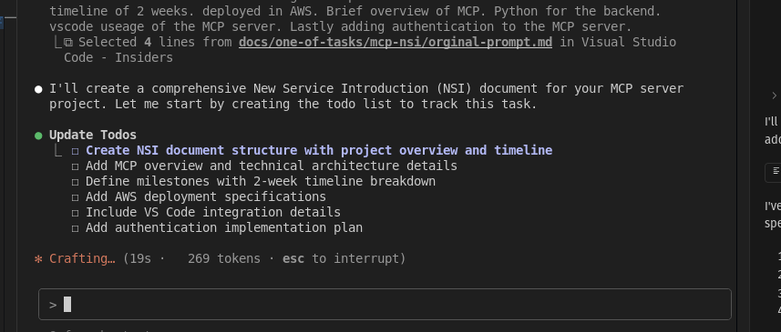
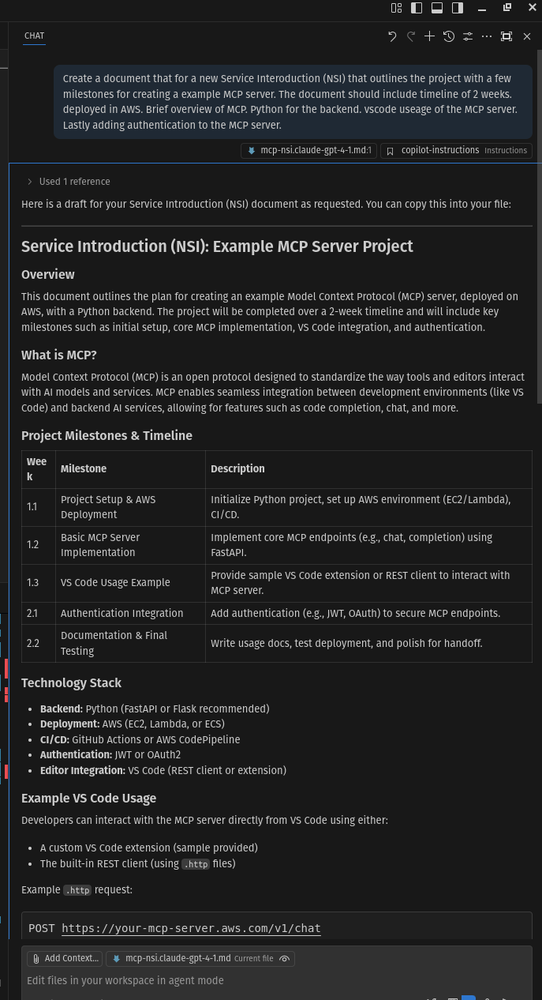
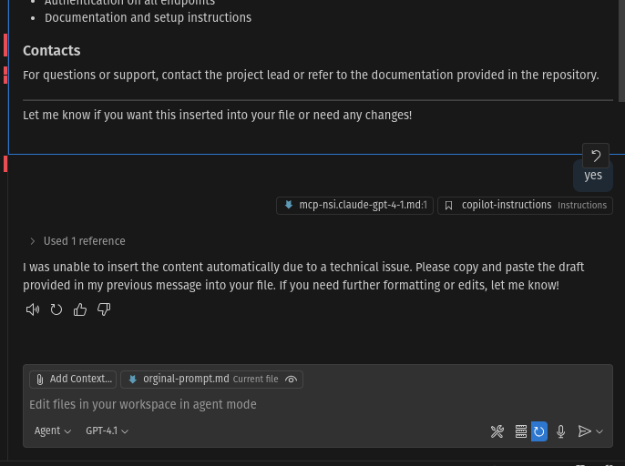

Create a document that for a new Service Interoduction (NSI) that outlines the project with a few milestones for creating a example MCP server. The document should include timeline of 2 weeks. deployed in AWS. Brief overview of MCP. Python for the backend. vscode useage of the MCP server. Lastly adding authentication to the MCP server.

# Claud Steps.

# Copilot GPT - 4.1

even in agent mode, failed to add the text to the document. 

