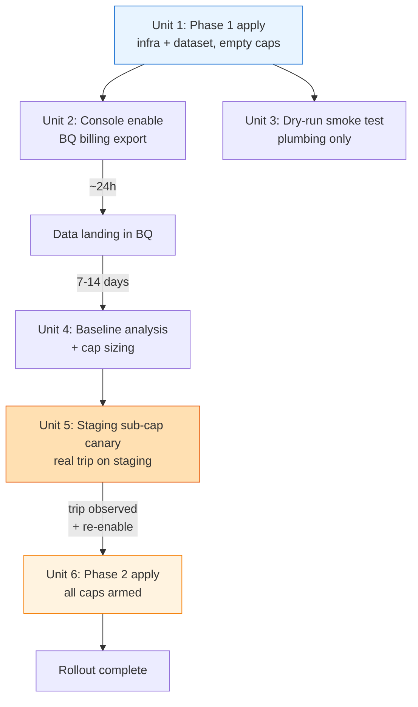

# feat: Roll out GCP billing kill-switch + BigQuery export

## Overview

Operational rollout of the already-authored `infra/gcp-billing/` Terraform stack. Phase 1
provisions the shared infra (Pub/Sub topic, kill-switch Cloud Function, service account,
BigQuery dataset) without any budgets. A 1–2 week observation window then yields real
per-project spend data from the BigQuery export. Phase 2 fills in `project_caps` with
informed numbers and applies again, arming a per-project kill-switch that disables
billing on any project that crosses its monthly cap.

## Problem Frame

GCP has no native hard spend cap. All six projects under billing account
`015529-D0D3BB-5BEDEE` — including personal experiments like `jarvis-home-487516` —
are currently exposed to unbounded spend if something goes wrong (runaway Cloud Run
instances, buggy Cloud SQL query loops, API abuse). The stack built during the
previous session implements Google's canonical pattern for a _reactive_ kill-switch
(budget → Pub/Sub → function → `updateBillingInfo`). This plan is about safely putting
it into operation without guessing at cap values that could trip under normal load.

### Known Limitations of the Mechanism

- **Cloud Billing budget notifications lag actual spend by ~4–24 hours.** This is
  inherent to how Google aggregates cost data — no billing-side mechanism (console
  budgets, BQ-export-based alerts, Cloud Monitoring billing metrics, third-party
  tools) reads from faster-than-lagging data. A sudden spike can multiply spend
  several times over the cap before the trip fires. Caps should be sized assuming
  burn-through is possible ("I'm willing to spend up to N× the cap in a worst-case
  incident before the kill-switch catches up").
- **Preventive quotas are a separate, complementary mechanism** — not a replacement.
  Cloud Run `max_instances`, Cloud SQL tier limits, per-API quotas, and organization
  policies constrain resource creation in real time. They're out of scope here but
  worth considering as a follow-up layer; the right overall design is _quotas for
  prevention + kill-switch for the long tail_.
- **Self-kill is acceptable.** If `blog-towles-production` (the host project) trips
  its own cap, the function calls `updateBillingInfo` synchronously before its own
  billing is disabled, so the kill itself completes. After that, the Pub/Sub topic
  and function go offline until the host is manually re-linked — meaning other
  projects are temporarily unprotected from _new_ trips. Accepted on the basis that
  (a) trips are rare, (b) if prod blew its cap you have bigger problems and will
  notice, (c) the alternative (a dedicated admin project) is heavier than the risk
  warrants for a personal-scale setup.

## Requirements Trace

- **R1.** Kill-switch infrastructure is live on `blog-towles-production` (host project)
  and armed-but-inert until caps are set.
- **R2.** BigQuery billing export is actively landing data from billing account
  `015529-D0D3BB-5BEDEE` into `blog-towles-production.billing_export`.
- **R3.** Per-project spend baseline is documented from at least 7 days of real export
  data before any cap is set.
- **R4.** Every project on the billing account has a cap — no gaps.
- **R5.** Cap values include enough headroom (≥2× observed baseline or a floor, whichever
  is higher) to avoid tripping under normal usage.
- **R6.** The function is verified to work end-to-end (at least a dry-run) before caps
  are armed, so tripping behavior isn't discovered for the first time during a real
  incident.
- **R7.** Re-enable procedure is known and documented (the code handles this already;
  this plan just verifies the user has run through it once in thought).

## Scope Boundaries

- Not redesigning the Terraform stack — only applying and validating it.
- Not adding email/Slack notifications when billing gets disabled. (Default IAM
  recipients on the budget notify the billing admin by email; that's sufficient for v1.)
- Not adding dead-letter queue on Pub/Sub failures.
- Not tuning caps beyond a first informed pass; iteration will happen naturally month
  over month.
- Not setting per-service quotas (`compute.googleapis.com` quotas, etc.).
- Not migrating existing terraform stacks (`infra/terraform/`) to share state or
  modules with `infra/gcp-billing/`.

### Deferred to Separate Tasks

- **Alerting/notification on billing disable event:** Follow-on work. The current
  behavior is: budget sends email to billing admin + function writes Cloud Logging
  entry. Upgrading to Slack/pager requires a second Pub/Sub subscription or a
  logs-based alerting policy.
- **Per-service preventive quotas** (Cloud Run `max_instances`, Cloud SQL tier caps,
  API-per-minute quotas): the complementary mechanism that makes reactive caps less
  load-bearing. Worth a follow-up plan once this one is rolled out.

## Context & Research

### Relevant Code and Patterns

- `infra/gcp-billing/main.tf` — providers, backend, API enablement
- `infra/gcp-billing/bigquery_export.tf` — BQ dataset + IAM for billing-export SA
- `infra/gcp-billing/pubsub_function.tf` — Pub/Sub topic, runtime SA, 2nd-gen function
- `infra/gcp-billing/budgets.tf` — `google_billing_budget` resources, for_each over
  `var.project_caps` (default `{}`)
- `infra/gcp-billing/function/index.js` — Node.js 20 handler; parses
  `budgetDisplayName = spend-cap-<project_id>`; idempotent on
  `billingEnabled == false`
- `infra/gcp-billing/terraform.tfvars` — authoritative cap map; currently `{}`
- `infra/gcp-billing/README.md` — has the console enable URL, synthetic-publish
  test commands, and re-enable steps already written
- `infra/terraform/modules/cost-scheduler/` — prior-art Cloud Function deployment
  pattern that `gcp-billing/` is modeled after (same GCS source bucket shape, same
  `googleapis` npm package, same 2nd-gen layout)

### Institutional Learnings

No `docs/solutions/` directory in this repo. Relevant lessons from this session's
context:

- **Billing export cannot be provisioned by Terraform.** The google provider has no
  resource for `billingAccounts.updateBillingExport`. Dataset + IAM via TF; enable via
  console. This is why Unit 2 exists as a standalone manual step.
- **`budget_filter.projects` requires project _numbers_, not IDs.** `budgets.tf`
  already handles this via `data "google_project"` lookup — worth flagging if any of
  the 6 projects fail to resolve.
- **`roles/billing.projectManager` on the billing account (not a project) is the
  minimal role needed to call `updateBillingInfo` with an empty `billingAccountName`.**
  Already encoded in `pubsub_function.tf`.

### External References

- <https://cloud.google.com/billing/docs/how-to/notify#cap_disable_billing> — the
  canonical pattern this stack implements.
- <https://cloud.google.com/billing/docs/how-to/export-data-bigquery-setup> — manual
  console enable procedure for BQ export.

## Key Technical Decisions

- **Two-phase rollout instead of one.** Phase 1 provisions everything but budgets;
  Phase 2 adds budgets after real spend data exists. Rationale: setting caps without
  baseline data risks tripping production under normal load; the extra apply has
  negligible cost and maximum safety.
- **Host everything in `blog-towles-production`.** Most stable project, already holds
  the existing TF state bucket, already has the most mature IAM. Self-kill (the host
  project tripping its own cap) is an accepted limitation, documented in Problem Frame.
- **Use `roles/billing.admin` on the function SA, not `roles/billing.projectManager`.**
  Matches Google's canonical sample and eliminates uncertainty about whether the
  narrower role is sufficient for `updateBillingInfo` with an empty
  `billingAccountName`. Tradeoff: slightly broader role, but scoped to this billing
  account only and used by a single function.
- **Budget `displayName = spend-cap-<project_id>` is load-bearing.** It's the only
  link between the budget notification and the project the function should kill.
  The function enforces an allowlist (`ALLOWED_PROJECTS` env var derived from
  `var.project_caps`) so a forged or stale budget can't cause a kill on a project
  that isn't explicitly managed by this Terraform.
- **Caps are per-project, not billing-account-wide.** Limits blast radius — one
  runaway project can't take down the production blog.
- **Staging sub-cap live canary before Phase 2.** Rather than a synthetic-payload
  dry-run of the kill path, the first real end-to-end test is done by applying a
  deliberately-too-low cap to `blog-towles-staging` (a project whose brief
  billing-disable is recoverable), observing the real budget → Pub/Sub → function →
  `updateBillingInfo` path, re-enabling, and then applying the correct caps to all
  projects. This exercises every IAM grant that a synthetic publish skips.

## Open Questions

### Resolved During Planning

- _Which project hosts the infra?_ `blog-towles-production`. Reuses existing TF state
  bucket `blog-towles-production-tfstate` with prefix `terraform/gcp-billing`.
- _BigQuery export cost at personal scale?_ Effectively free. Storage ≪ 100 MB/year;
  queries within 1 TB/month free tier.
- _Run external research?_ No — Google's pattern is canonical and already encoded in
  the code.
- _Should Phase 1 include a live trip test?_ No. Dry-run only until Phase 2 caps are
  armed. A live trip is Unit 6 and optional.

### Deferred to Implementation

- **Actual cap values per project.** Will be determined by Unit 4's analysis of BQ
  data. The rough heuristic is `max(2 × observed monthly baseline, $10 floor)`, but
  the concrete numbers require the data.
- **Whether to drop `gen-lang-client-0238175572` from the billing account.** This
  project's origin is unclear (likely auto-provisioned by a Google service); it may
  be safer to unlink it than to give it a cap. Inspect in Unit 4.
- **Whether the detailed usage cost export is needed.** Unit 2 enables standard usage
  cost; detailed (per-SKU) is a second toggle. Decision deferred until Unit 4 shows
  whether per-SKU breakdown is needed to understand spend.
- **Exact terraform provider version after apply.** `terraform validate` already
  passed against hashicorp/google 5.45.2; a real `init` may pick up a newer patch
  version. If so, commit the resulting `.terraform.lock.hcl`.
- **Exact sub-cap value for the staging canary in Unit 5.** Will be set to a value
  definitely below current MTD spend on `blog-towles-staging` (based on BQ data from
  Unit 4). Goal is immediate trip on next budget evaluation.

## High-Level Technical Design

> _This illustrates the intended rollout sequence and is directional guidance for review,
> not implementation specification._



## Implementation Units

- [x] **Unit 1: Phase 1 apply — provision infra with empty `project_caps`** ✅ applied 2026-04-14

  **Post-apply correction:** the two `*_iam_member` resources granting IAM to Google-managed
  service agents (`gcp-sa-billing-bq-exp` and `gcp-sa-billingbudgets`) were **removed from
  the Terraform** after the first apply failed with "Service account ... does not exist".
  These agents are provisioned lazily by Google on first use of the corresponding service
  (BQ billing export in Unit 2; first budget creation in Unit 5). Google auto-grants the
  required roles at that time, so the removed bindings were redundant as well as
  prematurely-referenced. Final resource count: 20 created (originally planned 22).

**Goal:** Apply `infra/gcp-billing/` against billing account `015529-D0D3BB-5BEDEE` so
that the Pub/Sub topic, runtime service account, IAM bindings, Cloud Function, and
BigQuery dataset exist. No budgets yet — `project_caps = {}` means zero
`google_billing_budget` resources are created.

**Requirements:** R1

**Dependencies:**

- The applying identity must be a **user account** (not a CI service account — existing CI
  SAs almost certainly lack `roles/billing.admin`) with:
  - `roles/billing.admin` on billing account `015529-D0D3BB-5BEDEE` (needed to grant
    `roles/billing.projectManager` to the function SA via
    `google_billing_account_iam_member`, and to create budgets in Unit 5)
  - `roles/editor` or equivalent resource-creation roles on `blog-towles-production`
- `gcloud auth application-default login` active for that identity.
- Precondition: `gcloud billing budgets list --billing-account=015529-D0D3BB-5BEDEE`
  returns no entries starting with `spend-cap-` (avoids display-name collisions with
  manually-created budgets that would cause the function to double-fire or target the
  wrong project).

**Files:**

- Modify: `infra/gcp-billing/terraform.tfvars` (confirm `project_caps = {}`)
- Artifacts (not committed): `.terraform/`, `.terraform.lock.hcl`, `function.zip`

**Approach:**

- Run `terraform init -backend-config=backend.tfvars` (first-time init against the
  GCS backend at `gs://blog-towles-production-tfstate/terraform/gcp-billing/`).
- Run `terraform plan -var-file=terraform.tfvars`. Expect:
  - ~10 `google_project_service` resources
  - 1 `google_pubsub_topic`
  - 1 `google_service_account`
  - 1 `google_billing_account_iam_member`
  - 3 `google_project_iam_member`
  - 1 `google_storage_bucket` + 1 `google_storage_bucket_object`
  - 1 `google_bigquery_dataset` + 1 `google_bigquery_dataset_iam_member`
  - 1 `google_cloudfunctions2_function`
  - 0 `google_billing_budget`
- Review the plan; apply if clean.
- Commit `.terraform.lock.hcl` so CI or future applies get the same provider versions.

**Patterns to follow:**

- `infra/terraform/modules/cost-scheduler/main.tf` — same `archive_file` + GCS object
  - `google_cloudfunctions2_function` layout, already known to apply cleanly.

**Test scenarios:**

- _Happy path:_ `terraform apply` exits 0, `terraform state list` shows all expected
  resources, no `google_billing_budget.*` entries present.
- _Error path — billing account IAM missing:_ if the applying identity lacks
  `roles/billing.admin`, the `google_billing_account_iam_member` resource fails with
  a permission error. Expected, recoverable.
- _Error path — API not yet propagated:_ first-time API enablement can take 1–2 min
  to propagate; a retry of `apply` after the propagation error should succeed.

**Verification:**

- `gcloud pubsub topics describe billing-cap-alerts --project=blog-towles-production`
  returns a topic.
- `gcloud functions describe billing-kill-switch --gen2 --region=us-central1
--project=blog-towles-production` returns `ACTIVE` state.
- `gcloud iam service-accounts list --project=blog-towles-production` includes
  `billing-kill-switch@…`.
- `bq ls --project_id=blog-towles-production` shows `billing_export`.

---

- [x] **Unit 2: Enable BigQuery billing export in the Billing Console** ✅ enabled 2026-04-14

  **Note for future reference:** the actual billing-export service agent granted access
  when enabling Standard usage cost export was `billing-export-bigquery@system.gserviceaccount.com`
  (the legacy format), not the `@gcp-sa-billing-bq-exp.iam.gserviceaccount.com` format
  my original Terraform assumed. Confirming IAM auto-grant happens regardless — no manual
  IAM step needed.

**Goal:** Start data flowing from billing account `015529-D0D3BB-5BEDEE` into
`blog-towles-production.billing_export`. This cannot be done via Terraform.

**Requirements:** R2

**Dependencies:** Unit 1 (dataset must exist).

**Files:** None — console-only change.

**Approach:**

- Navigate to
  <https://console.cloud.google.com/billing/015529-D0D3BB-5BEDEE/export>.
- Under _BigQuery export_ → _Standard usage cost_ → _Edit settings_:
  - Project: `blog-towles-production`
  - Dataset: `billing_export`
  - Save.
- Decide on _Detailed usage cost_ export (per-SKU granularity). Default: skip for now,
  revisit in Unit 4 if needed.
- Skip _Pricing_ export (not useful for spend caps).

**Test scenarios:**

- _Happy path:_ ~24h after save, `bq ls blog-towles-production:billing_export` lists
  a table named `gcp_billing_export_v1_015529_D0D3BB_5BEDEE`.
- _Error path — IAM missing:_ if the billing-export service agent
  (`service-<project_number>@gcp-sa-billing-bq-exp.iam.gserviceaccount.com`) wasn't
  granted `roles/bigquery.dataEditor` on the dataset, the console save will fail with
  a permission error. Unit 1's `google_bigquery_dataset_iam_member` should have
  handled this — if it didn't, re-check the grant.
- _Edge case — service agent not yet provisioned:_ the billing-export service agent
  is typically created by Google the first time BQ export is configured on a billing
  account. Unit 1's `google_bigquery_dataset_iam_member` does not validate principals,
  so the grant is accepted regardless. After the console save in Unit 2, re-check the
  IAM binding still references the now-existing agent; if the console recreated or
  relocated the agent, `terraform apply` again to refresh the binding.

**Verification:**

- Console shows the export as _Configured_ with the correct project/dataset.
- After 24h, a trivial BQ query returns rows:
  ```sql
  SELECT COUNT(*) AS row_count, MAX(usage_start_time) AS latest
  FROM `blog-towles-production.billing_export.gcp_billing_export_v1_015529_D0D3BB_5BEDEE`;
  ```

---

- [x] **Unit 3: Smoke-test the kill-switch with a dry-run publish** ✅ passed 2026-04-14

  **Note for future reference:** the initial function deploy used a bare
  `exports.killSwitch = (cloudEvent) => {...}` export, which the Functions
  Framework interpreted as a 1st-gen background signature — causing every invocation
  to log "No Pub/Sub message payload; ignoring" because `cloudEvent.data.message.data`
  was undefined under that shape. Fix: added `@google-cloud/functions-framework` as
  a dependency and switched to explicit CloudEvent registration via
  `functions.cloudEvent('killSwitch', async (cloudEvent) => {...})`. All 4 test
  scenarios (dry-run, missing fields, below-cap, allowlist-reject) pass after
  redeploy. Zero UpdateBillingInfo audit events, confirming guards are tight.

**Goal:** Verify the full path — Pub/Sub → Eventarc → Cloud Run function invocation
→ Cloud Logging — works end-to-end before any real budget is wired up. Use a payload
whose `budgetDisplayName` does not start with `spend-cap-` so the function
log-and-exits without touching billing.

**Requirements:** R6

**Dependencies:** Unit 1.

**Files:** None — runtime verification only.

**Approach:**

- Publish a synthetic payload via `gcloud pubsub topics publish billing-cap-alerts
--project=blog-towles-production --message='{"budgetDisplayName":"dry-run",…}'`
  (exact command in `infra/gcp-billing/README.md`).
- Immediately tail the function logs:
  `gcloud functions logs read billing-kill-switch --gen2 --region=us-central1
--project=blog-towles-production --limit=50`.
- Expect a log line containing `Ignoring: budgetDisplayName "dry-run" does not match
spend-cap-<project>`.

**Test scenarios:**

- _Happy path — dry-run message:_ `budgetDisplayName: "dry-run"` → function logs
  "Ignoring…" and exits.
- _Edge case — missing costAmount/budgetAmount:_ payload with only `budgetDisplayName`
  set → function logs "costAmount/budgetAmount missing or non-numeric" and exits.
- _Edge case — below-threshold payload:_ `budgetDisplayName: "spend-cap-fake-project"`,
  `costAmount: 1`, `budgetAmount: 100` → function logs "Below cap (cost=1 <
  budget=100); no action" and exits. Proves the threshold guard works without
  requiring a real project.

**Verification:**

- All three log messages appear in Cloud Logging.
- Function execution metrics show 3 successful invocations, 0 errors.
- No `cloudbilling.googleapis.com` audit log entries for `UpdateBillingInfo` (the
  function never called it).

---

- [ ] **Unit 4: Observation window + baseline analysis + cap sizing**

**Goal:** After 7–14 days of BQ export data, compute a per-project monthly spend
baseline and pick cap values with enough headroom to avoid tripping under normal load.

**Requirements:** R3, R4, R5

**Dependencies:** Unit 2 (export must be landing data ≥ 7 days).

**Files:**

- Modify: `infra/gcp-billing/terraform.tfvars` (fill in `project_caps` map)
- Create (optional, not committed): a scratch notes file with the BQ query output
  for future reference

**Approach:**

- Run a per-project rollup query against
  `blog-towles-production.billing_export.gcp_billing_export_v1_015529_D0D3BB_5BEDEE`:
  ```sql
  SELECT project.id AS project_id,
         SUM(cost) AS mtd_cost,
         SUM(cost) / DATE_DIFF(CURRENT_DATE(), DATE(MIN(usage_start_time)), DAY)
           * 30 AS projected_monthly
  FROM `blog-towles-production.billing_export.gcp_billing_export_v1_015529_D0D3BB_5BEDEE`
  WHERE invoice.month = FORMAT_DATE('%Y%m', CURRENT_DATE())
  GROUP BY project.id
  ORDER BY mtd_cost DESC;
  ```
- For each project, compute cap as `max(ceil(2 × projected_monthly), floor)` where
  `floor` is:
  - `$50` for `blog-towles-production` (can't let this trip on normal traffic)
  - `$15` for `blog-towles-staging` (auto-sleeps overnight via cost-scheduler)
  - `$10` for all other projects (personal/experimental)
- Inspect `gen-lang-client-0238175572` spend specifically. If ~$0 and origin is
  unknown, consider asking the user to unlink it from the billing account entirely
  instead of giving it a cap.
- If any project projects above its floor, use `ceil(2 × projected_monthly)`.
- Round caps to tidy integers (USD units must be integers per `google_billing_budget`
  amount spec anyway).
- Commit the updated `terraform.tfvars`.

**Test scenarios:** — _Test expectation: none — this is an analysis and configuration
unit with no behavioral change. Verification is the baseline documentation + tfvars
diff._

**Verification:**

- Every project on billing account `015529-D0D3BB-5BEDEE` appears as a key in
  `project_caps` (enforce R4: no gaps).
- Every cap value is ≥ 2× observed projected monthly spend, floored at the per-tier
  minimum.
- `terraform plan -var-file=terraform.tfvars` shows N creations of
  `google_billing_budget.project_cap["<project>"]` where N = number of projects on
  the billing account.

---

- [ ] **Unit 5: Staging sub-cap live canary — mandatory IAM + end-to-end validation**

**Goal:** Prove the full real path — a real Cloud Billing budget firing a real
threshold notification through real Pub/Sub → real function → real
`updateBillingInfo` — before arming caps on every project. Uses `blog-towles-staging`
because its billing being briefly disabled is recoverable (no user-facing traffic,
Cloud SQL data persists across billing-disable, cost-scheduler auto-sleep limits
ongoing spend anyway).

**Requirements:** R6 end-to-end (Unit 3 only tested the plumbing; this tests the
`updateBillingInfo` IAM path that Unit 3 deliberately skipped), R7.

**Dependencies:** Unit 4 (baseline MTD spend for staging must be known so the
canary cap is set below it).

**Files:**

- Modify: `infra/gcp-billing/terraform.tfvars` — temporarily set
  `project_caps = { "blog-towles-staging" = <N> }` where N is clearly below staging's
  current MTD spend. All other projects remain absent from the map for this step.

**Approach:**

- Confirm staging's current MTD spend from the BQ query in Unit 4 (e.g., if MTD is
  $3.50, set cap to `1`).
- `terraform apply -var-file=terraform.tfvars` — creates only the staging budget
  plus a function redeploy (the `ALLOWED_PROJECTS` env var changes to include
  `blog-towles-staging`).
- Wait for the next budget evaluation cycle. **This may take 1–24 hours** given
  known budget notification lag — do not interpret a delayed trip as a failure.
- Observe in order:
  - Budget notification published to topic (visible in Pub/Sub subscription metrics
    or `gcloud pubsub` read).
  - Cloud Function logs show: `"Disabling billing on blog-towles-staging (cost=X >=
budget=<N>)"`.
  - `gcloud billing projects describe blog-towles-staging` returns
    `billingEnabled: false`.
  - Cloud SQL instance in staging is unreachable; Cloud Run staging service returns
    errors.
- Re-enable:
  ```
  gcloud billing projects link blog-towles-staging \
    --billing-account=015529-D0D3BB-5BEDEE
  ```
  Confirm `billingEnabled: true`. Cloud SQL + Cloud Run recover.
- **Idempotency check:** while billing is disabled (before re-enable), the budget
  may continue firing at subsequent evaluation cycles. Confirm the function logs
  `"Billing already disabled on blog-towles-staging; exiting idempotently"` for each
  subsequent invocation and does not re-call `updateBillingInfo`.
- Reset `terraform.tfvars` back to the full correct caps from Unit 4 (staging's
  real cap, not $1).

**Patterns to follow:**

- The existing `cost-scheduler` module in `infra/terraform/modules/cost-scheduler/`
  already uses `google_cloudfunctions2_function` and a Pub/Sub-adjacent trigger
  pattern; this unit's reasoning about re-enable and Cloud SQL recovery is informed
  by that module's operational behavior.

**Test scenarios:**

- _Happy path — real over-cap trip:_ budget with `specified_amount < MTD cost` fires
  within 1–24h, function disables billing on staging, `billingEnabled: false`.
- _Edge case — idempotent retrips:_ subsequent budget evaluations during the
  billing-disabled window invoke the function; it log-and-exits without duplicate
  `updateBillingInfo` calls. Proves the `getBillingInfo` idempotency guard works
  with real API responses.
- _Error path — IAM insufficient (diagnostic):_ if `roles/billing.admin` on the
  function SA is somehow not fully propagated, the function errors on
  `updateBillingInfo` with PERMISSION_DENIED and `RETRY_POLICY_RETRY` re-invokes.
  Cloud Logging shows the error. Expected diagnostic outcome — do NOT proceed to
  Unit 6 until this test passes cleanly.
- _Edge case — ALLOWED_PROJECTS allowlist:_ verify by publishing a synthetic payload
  with `budgetDisplayName: "spend-cap-jarvis-home-487516"` _before_ Unit 6 arms
  jarvis's cap. The allowlist contains only `blog-towles-staging` at this point, so
  the function must log `"Refusing: projectId \"jarvis-home-487516\" not in
ALLOWED_PROJECTS allowlist"` and exit. Proves the forged-trip defense.

**Verification:**

- `gcloud billing projects describe blog-towles-staging` showed `billingEnabled:
false` during the window, then `true` after re-link.
- Cloud Audit Logs show exactly one successful `UpdateBillingInfo` call for the
  staging project during the window; subsequent retrips did not re-call it.
- Staging site/services recovered without data loss after re-enable.
- Synthetic forged-trip payload was rejected by the allowlist.

---

- [ ] **Unit 6: Phase 2 apply — arm caps on all remaining projects**

**Goal:** Apply the correct cap map from Unit 4 to every project on the billing
account. Budgets become visible in the Billing Console; threshold crossings will
publish to the Pub/Sub topic; kill-switch will fire on a 100% crossing.

**Requirements:** R4, R5

**Dependencies:** Unit 5 must have passed cleanly (real IAM path proven).

**Files:**

- Modify: `infra/gcp-billing/terraform.tfvars` — set the full `project_caps` map
  from Unit 4 (not the sub-$1 staging-only map from Unit 5).

**Approach:**

- `terraform plan -var-file=terraform.tfvars` — verify:
  - Staging budget updates in place (from $1 back to its real cap).
  - All other project budgets are created.
  - Function is updated in-place to reflect the expanded `ALLOWED_PROJECTS` env var.
  - No unexpected destructions.
- `terraform apply -var-file=terraform.tfvars`.
- Eyeball the Billing Console budget list to confirm every project has its cap
  present and threshold rules at 50/90/100%.

**Patterns to follow:**

- Same apply procedure as Unit 1, with the full caps map.

**Test scenarios:**

- _Happy path:_ `apply` exits 0. N−1 budget creations (all projects except staging)
  - 1 budget update (staging: $1 → real cap) + 1 function update-in-place (for
    `ALLOWED_PROJECTS` env var).
- _Error path — project-number lookup fails:_ if `data.google_project.capped[<id>]`
  can't resolve (project renamed or removed between tfvars edit and apply), apply
  fails at plan time. Expected and safe — correct the tfvars and retry.
- _Integration:_ After apply,
  `gcloud billing budgets list --billing-account=015529-D0D3BB-5BEDEE` shows N
  budgets, each with `displayName` matching `spend-cap-<project_id>`.
- _R4 coverage check:_ the set difference
  `gcloud billing projects list --billing-account=015529-D0D3BB-5BEDEE
--format='value(projectId)'` minus `keys(var.project_caps)` is empty. Any project
  on the billing account without a cap is an R4 violation.

**Verification:**

- Every project listed by
  `gcloud billing projects list --billing-account=015529-D0D3BB-5BEDEE` has a
  corresponding budget (R4 coverage check, above).
- Each budget's `allUpdatesRule.pubsubTopic` points at
  `projects/blog-towles-production/topics/billing-cap-alerts`.
- Terraform state contains exactly N `google_billing_budget.project_cap` entries.
- Function's deployed `ALLOWED_PROJECTS` env var contains every project_id (not just
  staging). Verify via `gcloud functions describe billing-kill-switch --gen2
--region=us-central1 --project=blog-towles-production
--format='value(serviceConfig.environmentVariables.ALLOWED_PROJECTS)'`.

## System-Wide Impact

- **Interaction graph:** `google_billing_budget` resources → Pub/Sub topic
  `billing-cap-alerts` → Eventarc trigger → Cloud Function `billing-kill-switch` →
  `cloudbilling.googleapis.com/v1/projects.updateBillingInfo`. Any service on any of
  the 6 projects is downstream of a successful trip (billing-off → Cloud Run /
  Cloud SQL / storage egress all start failing within minutes).
- **Error propagation:** Function errors retry per `RETRY_POLICY_RETRY` on the event
  trigger. A runaway bug in the function would retry publishes repeatedly; budget
  events are low volume (a few per day max), so retry-storm risk is negligible.
- **State lifecycle risks:** A budget-triggered disable leaves the project in a
  "billing-disabled but resources still exist" state until manually re-enabled.
  Cloud SQL instances, Cloud Run services, GCS buckets don't get deleted — just
  deactivated. Re-link restores service.
- **API surface parity:** Not applicable — this is net-new infra with no existing
  API surface.
- **Integration coverage:** Unit 3 (dry-run) and Unit 6 (live trip) provide the
  cross-layer integration coverage that unit tests alone couldn't prove. Pub/Sub
  trigger wiring, Eventarc SA token creation, and function SA billing-IAM are all
  only exercised at runtime.
- **Unchanged invariants:** The existing `infra/terraform/` stacks (prod + staging
  Cloud Run) are untouched. State bucket `blog-towles-production-tfstate` is shared
  but uses a distinct prefix (`terraform/gcp-billing` vs. `terraform/state`); no
  collision risk.

## Risks & Dependencies

| Risk                                                                                                                                                                           | Mitigation                                                                                                                                                                                                                                                                                                                                                        |
| ------------------------------------------------------------------------------------------------------------------------------------------------------------------------------ | ----------------------------------------------------------------------------------------------------------------------------------------------------------------------------------------------------------------------------------------------------------------------------------------------------------------------------------------------------------------- |
| **Budget-notification latency (4–24h) means spend can burn past cap before trip fires.**                                                                                       | Documented as a Known Limitation in Problem Frame. Cap sizing in Unit 4 should price in worst-case 1-day burn rate, not treat the cap as a real-time ceiling. Per-service preventive quotas (deferred to a separate task) are the complementary mechanism for real-time spend bounding.                                                                           |
| **Host project (`blog-towles-production`) self-kill takes the kill-switch offline.**                                                                                           | Accepted limitation: the in-flight kill completes synchronously before the function's own billing is disabled, so the trip itself isn't lost. Other projects are temporarily unprotected from _new_ trips until the host is re-linked. Mitigation = keep prod's cap high enough that it rarely trips, and monitor the billing-admin email that fires on any trip. |
| **A cap set too low trips the production blog.**                                                                                                                               | Unit 4 enforces `≥ 2× observed baseline` and a `$50` floor for `blog-towles-production`. If uncertain, err higher — the cap can always be lowered later.                                                                                                                                                                                                          |
| **BigQuery export never starts landing data.**                                                                                                                                 | Unit 2 explicitly depends on the dataset-IAM grant from Unit 1. Verification query in Unit 2 checks for data within 24h. If absent, first place to check is the billing-export SA's `bigquery.dataEditor` grant on the dataset.                                                                                                                                   |
| **IAM insufficient or unpropagated when first real trip fires.**                                                                                                               | Using `roles/billing.admin` (not the narrower `roles/billing.projectManager`) eliminates role-sufficiency uncertainty. Unit 5's staging sub-cap canary is mandatory and exercises the real `updateBillingInfo` IAM path end-to-end before Unit 6 arms any remaining caps.                                                                                         |
| **Forged Pub/Sub message from an identity with project-level `roles/editor` could disable billing on an unrelated project.**                                                   | Function enforces an `ALLOWED_PROJECTS` allowlist derived from `var.project_caps`; any projectId not in the allowlist is rejected and logged. Topic-level IAM additionally grants publish only to the billing-budgets service agent (defense in depth; project-level IAM can still inherit publish).                                                              |
| **Billing-admin email notifications are the only human signal of a trip.**                                                                                                     | Acceptable for v1; default IAM recipients are enabled in `budgets.tf`. Notification upgrade (Slack/pager) is explicitly deferred.                                                                                                                                                                                                                                 |
| **`gen-lang-client-0238175572` is auto-provisioned by a Google service and can't be unlinked.**                                                                                | Unit 4 inspects this specifically. Fallback: give it a minimal cap ($10) like any other project.                                                                                                                                                                                                                                                                  |
| **Provider version drift between `validate` time and real `apply` time.**                                                                                                      | Commit `.terraform.lock.hcl` after Unit 1's `init` so subsequent applies are pinned.                                                                                                                                                                                                                                                                              |
| **Applying user's identity lacks `roles/billing.admin` on the billing account.**                                                                                               | Plan fails at `google_billing_account_iam_member` with a clear error. User elevates permissions and retries — no partial state because the resource hadn't been created yet.                                                                                                                                                                                      |
| **Budget manually edited or deleted in the Billing Console** (e.g., display name changed, breaking the `spend-cap-<project_id>` convention) **causes silent Terraform drift.** | Accepted. Re-running `terraform apply` on this stack restores the intended state. No scheduled drift detection is configured.                                                                                                                                                                                                                                     |

## Documentation / Operational Notes

- `infra/gcp-billing/README.md` already contains the apply commands, console-enable
  URL, synthetic-publish test payload, and re-enable command. It's the canonical
  operational doc — this plan complements it by sequencing the rollout and adding
  cap-sizing methodology.
- After Unit 4, consider leaving a comment in `terraform.tfvars` documenting the
  date and methodology of the cap numbers (e.g., `# Caps set 2026-04-28 from 14-day
baseline; see docs/plans/2026-04-14-001 for method`).
- No runbook, no on-call impact — this is a defensive kill-switch for a personal
  billing account, not a production service.

## Sources & References

- `infra/gcp-billing/` — the Terraform stack being rolled out
- `infra/gcp-billing/README.md` — operational playbook (commands, URLs, payloads)
- `infra/terraform/modules/cost-scheduler/` — prior-art Cloud Function module the
  new stack mirrors
- <https://cloud.google.com/billing/docs/how-to/notify#cap_disable_billing> — GCP
  canonical pattern
- <https://cloud.google.com/billing/docs/how-to/export-data-bigquery-setup> —
  manual BQ export enablement
- Previous session (2026-04-14): authored `infra/gcp-billing/`, passed
  `terraform validate` against hashicorp/google 5.45.2
