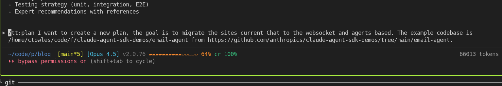
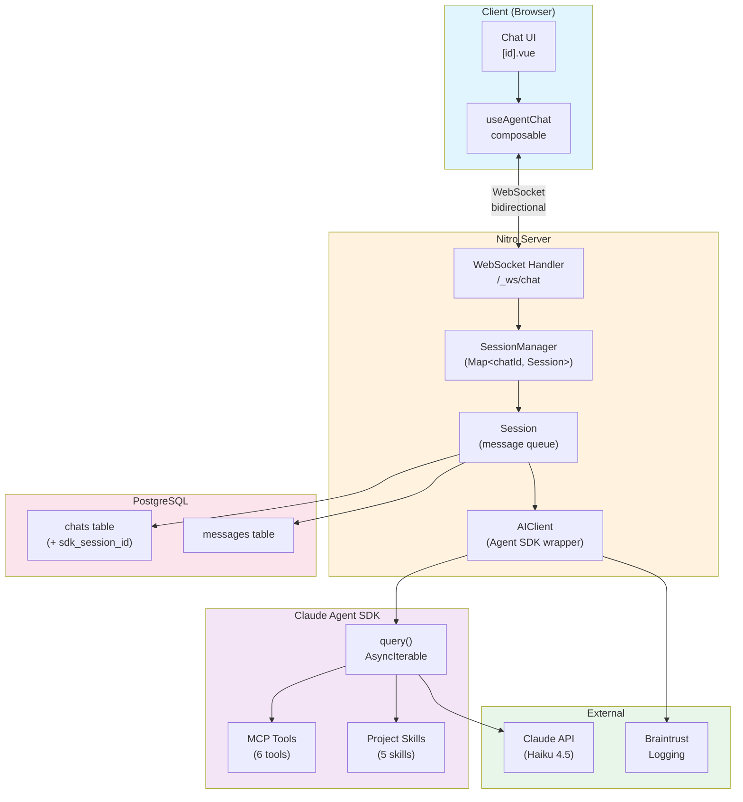
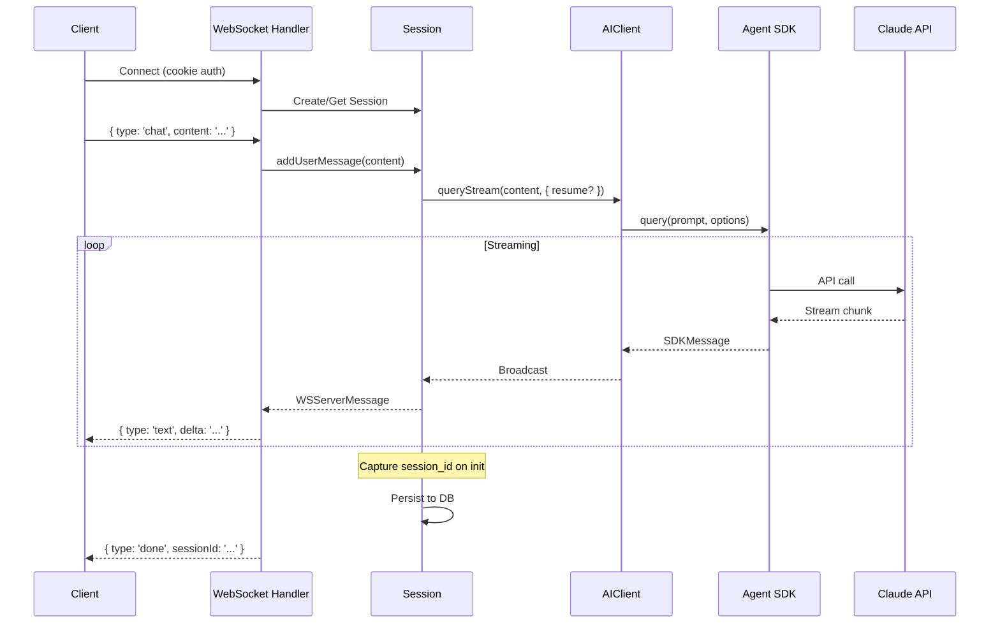

# WebSocket + Agent SDK Chat Migration Plan

## Created with:



_Created with tt:plan v1.0.5_

Then created Ralph implement command with with `tt:create_ralph_implement_command` command.

```bash
  /ralph-wiggum:ralph-loop "Read the plan at $(cat .current-plan)/plan.md and implement all tasks. Use red-green testing - write failing tests first, then make them pass. Never mock anything. Mark each task complete in the plan before moving to the next. Output <promise>DONE</promise> when all tasks are complete and tests pass. Use subagents to explore. /ultrathink" --completion-promise "DONE" --max-iterations 15

```

## Overview

Migrate the blog's chat from SSE (Server-Sent Events) to WebSocket with Claude Agent SDK integration. This enables real-time bidirectional communication, multi-turn sessions with resume capability, and project skills integration.

**Reference Implementation:** [email-agent](https://github.com/anthropics/claude-agent-sdk-demos/tree/main/email-agent)

## Key Decisions

| Decision              | Choice                  | Rationale                                                  |
| --------------------- | ----------------------- | ---------------------------------------------------------- |
| Agent Architecture    | Single unified agent    | Simpler than orchestrator, proven pattern from email-agent |
| Migration Strategy    | Clean cutover           | Remove SSE entirely once WS works                          |
| Model                 | Haiku 4.5               | Balance of speed and capability                            |
| Extended Thinking     | Always on (4096 tokens) | Keep current behavior                                      |
| Tool Visibility       | User-toggleable         | Add setting to show/hide tool invocations                  |
| WS Connection Scope   | Per-chat-page           | Connect on chat route enter, disconnect on leave           |
| Client Implementation | Nuxt useWebSocket       | Built-in composable with auto-reconnect                    |
| Reconnection          | Auto-reconnect + resume | Use SDK session_id to resume interrupted sessions          |
| Skills                | Project only            | 5 project skills (blog-helper, nuxt-v4, etc.)              |
| Auth                  | Cookie-based            | Use existing nuxt-auth-utils session                       |
| Concurrent Messages   | Block UI                | Disable input until current response completes             |
| Tool Timeouts         | 30s graceful error      | Return error to agent, let it respond gracefully           |
| Chat Titles           | Agent response metadata | Remove separate title generation API call                  |
| Observability         | Keep Braintrust         | Wrap agent calls with Braintrust logging                   |

## Current Architecture (SSE)

```
Client (useChat composable)
    ↓ POST /api/chats/[id]
Server (Nitro handler)
    ↓ ReadableStream + SSE events
Anthropic SDK (direct API calls)
    ↓ Stream chunks
Client (parse SSE, update UI)
```

**Key Files:**

- `server/api/chats/[id].post.ts` - SSE endpoint (305 lines)
- `app/composables/useChat.ts` - Client composable (224 lines)
- `server/utils/ai/tools.ts` - 6 tools (394 lines)
- `server/utils/ai/agent.ts` - Agent SDK wrapper (unused in chat)

## Target Architecture (WebSocket + Agent SDK)



### Data Flow



## Database Schema Changes

Add to `chats` table:

```typescript
// server/database/schema.ts
export const chats = pgTable('chats', {
  // existing columns...
  sdkSessionId: text('sdk_session_id'), // For multi-turn resume
  connectionStatus: text('connection_status'), // 'connected' | 'disconnected' | null
  lastActivityAt: timestamp('last_activity_at'), // For session cleanup
});
```

## Message Protocol

### Client → Server

```typescript
interface WSClientMessage {
  type: 'chat' | 'subscribe' | 'unsubscribe' | 'ping';
  chatId: string;
  content?: string; // For 'chat' type
  newConversation?: boolean;
}
```

### Server → Client

```typescript
interface WSServerMessage {
  type:
    | 'text'
    | 'reasoning'
    | 'tool_use'
    | 'tool_result'
    | 'done'
    | 'error'
    | 'title'
    | 'session_init'
    | 'pong';
  chatId: string;
  content?: string;
  delta?: string; // For streaming text/reasoning
  toolName?: string; // For tool_use
  toolId?: string;
  toolInput?: unknown;
  toolResult?: unknown; // For tool_result
  isError?: boolean;
  sessionId?: string; // SDK session ID for resume
  suggestedTitle?: string; // For title in agent response
}
```

## Implementation Phases

### Phase 1: WebSocket Infrastructure

**Files to create:**

- `server/routes/_ws/chat.ts` - Nitro WebSocket handler
- `server/utils/ws/session-manager.ts` - Manage active sessions
- `server/utils/ws/types.ts` - Message type definitions

**Tasks:**

- [ ] Create Nitro WebSocket handler at `/_ws/chat`
- [ ] Implement cookie-based auth in WS upgrade handler
- [ ] Create SessionManager class (Map<chatId, Session>)
- [ ] Implement ping/pong for connection health
- [ ] Add connection logging

**Reference:** `/home/ctowles/code/f/claude-agent-sdk-demos/email-agent/ccsdk/websocket-handler.ts`

### Phase 2: Agent SDK Integration

**Files to create:**

- `server/utils/ws/ai-client.ts` - Wrap Agent SDK for WebSocket
- `server/utils/ws/session.ts` - Single session class

**Tasks:**

- [ ] Create AIClient class wrapping Agent SDK `query()`
- [ ] Configure: Haiku 4.5, extended thinking (4096), max 10 turns
- [ ] Enable project skills via `settingSources: ['project']`
- [ ] Register MCP server with all 6 tools
- [ ] Create Session class with message queue
- [ ] Implement SDK session_id capture for multi-turn resume
- [ ] Add 30s timeout wrapper for tool execution
- [ ] Integrate Braintrust logging

**Reference:** `/home/ctowles/code/f/claude-agent-sdk-demos/email-agent/ccsdk/ai-client.ts`

### Phase 3: Message Streaming Bridge

**Tasks:**

- [ ] Map Agent SDK message types to WS server messages
- [ ] Stream text deltas as they arrive
- [ ] Stream reasoning deltas (extended thinking)
- [ ] Send tool_use events with name, id, input
- [ ] Send tool_result events after execution
- [ ] Extract suggested title from agent response
- [ ] Send done event with final message

**Message type mapping:**

```typescript
// Agent SDK → WebSocket
'AgentAssistantMessage' → 'text' | 'reasoning' | 'tool_use'
'AgentStreamEvent' → 'text' (delta) | 'reasoning' (delta)
'AgentResultMessage' → 'done' | 'error'
'AgentSystemMessage' (init) → 'session_init'
```

### Phase 4: Database Persistence

**Tasks:**

- [ ] Add `sdk_session_id`, `connection_status`, `last_activity_at` columns
- [ ] Create migration file
- [ ] Save SDK session_id after first response
- [ ] Update connection_status on connect/disconnect
- [ ] Persist messages to DB after each exchange
- [ ] Implement session cleanup for stale connections (60s timeout)

### Phase 5: Frontend Migration

**Files to create:**

- `app/composables/useAgentChat.ts` - New WebSocket composable

**Files to modify:**

- `app/pages/chat/[id].vue` - Use new composable
- `app/pages/chat/index.vue` - Create chat via WS

**Tasks:**

- [ ] Create useAgentChat composable using Nuxt useWebSocket
- [ ] Implement auto-reconnect with SDK session resume
- [ ] Add message state management (streaming → complete)
- [ ] Implement tool visibility toggle (user setting)
- [ ] Block input during streaming (isStreaming ref)
- [ ] Handle suggested title from agent
- [ ] Connect on route enter, disconnect on leave
- [ ] Update chat pages to use new composable

**Reference:** `/home/ctowles/code/f/claude-agent-sdk-demos/email-agent/client/hooks/useWebSocket.ts`

### Phase 6: Skills Integration

**Tasks:**

- [ ] Ensure `Skill` tool in allowedTools
- [ ] Configure `settingSources: ['project']`
- [ ] Update agent system prompt to reference available skills
- [ ] Test skill invocation (blog-helper, nuxt-v4)

**Available project skills:**

1. `blog-helper` - Blog content assistance
2. `fix-blog-images` - Image optimization
3. `nuxt-v4` - Nuxt development guidance
4. `slidev` - Presentation creation
5. `hosting` - GCP deployment

### Phase 7: Cleanup & Testing

**Tasks:**

- [ ] Remove SSE endpoint (`server/api/chats/[id].post.ts`)
- [ ] Remove old useChat composable
- [ ] Update any remaining API references
- [ ] Write WebSocket handler tests (see Testing Strategy)
- [ ] Write integration tests for agent flow
- [ ] Test reconnection + resume behavior
- [ ] Test tool timeout handling
- [ ] Load test concurrent connections

## Testing Strategy

Addressing concern: **WebSocket testing is harder than HTTP endpoints**

### Unit Tests

```typescript
// server/utils/ws/__tests__/session-manager.test.ts
describe('SessionManager', () => {
  it('creates session on subscribe');
  it('cleans up session after timeout');
  it('resumes session with SDK session_id');
});

// server/utils/ws/__tests__/ai-client.test.ts
describe('AIClient', () => {
  it('streams text deltas');
  it('handles tool execution');
  it('respects 30s timeout');
});
```

### Integration Tests

Use `vitest` with mock WebSocket:

```typescript
// tests/websocket-chat.test.ts
import { createWebSocketMock } from './helpers';

describe('WebSocket Chat', () => {
  it('authenticates via cookie');
  it('streams complete response');
  it('resumes after reconnect');
  it('blocks concurrent messages');
});
```

### E2E Tests

Use Playwright with WebSocket interception:

```typescript
// e2e/chat.spec.ts
test('chat flow', async ({ page }) => {
  await page.goto('/chat');
  await page.fill('[data-testid="chat-input"]', 'Hello');
  await page.click('[data-testid="send-button"]');
  await expect(page.locator('[data-testid="assistant-message"]')).toBeVisible();
});
```

### Manual Testing Checklist

- [ ] Send message, receive streaming response
- [ ] Tool invocation visible (when enabled)
- [ ] Toggle tool visibility works
- [ ] Reconnect after network drop resumes session
- [ ] Extended thinking blocks render correctly
- [ ] Chat title updates from agent response
- [ ] Input blocked during streaming
- [ ] Skill invocation works (test with blog-helper)

## File Structure (New/Modified)

```
server/
├── routes/
│   └── _ws/
│       └── chat.ts              # NEW: WebSocket handler
├── utils/
│   └── ws/
│       ├── types.ts             # NEW: Message types
│       ├── session-manager.ts   # NEW: Session management
│       ├── session.ts           # NEW: Single session
│       └── ai-client.ts         # NEW: Agent SDK wrapper
├── database/
│   └── schema.ts                # MODIFY: Add WS columns
└── api/
    └── chats/
        └── [id].post.ts         # DELETE after migration

app/
├── composables/
│   ├── useChat.ts               # DELETE after migration
│   └── useAgentChat.ts          # NEW: WebSocket composable
└── pages/
    └── chat/
        ├── index.vue            # MODIFY: Use new composable
        └── [id].vue             # MODIFY: Use new composable
```

## Expert Recommendations

### WebSocket in Nuxt/Nitro

Nitro supports WebSocket via experimental `websocket` option:

```typescript
// nuxt.config.ts
export default defineNuxtConfig({
  nitro: {
    experimental: {
      websocket: true,
    },
  },
});
```

**Reference:** [Nitro WebSocket docs](https://nitro.build/guide/websocket)

### Agent SDK Streaming

The Agent SDK's `query()` returns an `AsyncIterable<SDKMessage>`. Key patterns from email-agent:

```typescript
for await (const message of this.aiClient.queryStream(content, options)) {
  if (message.type === 'system' && message.subtype === 'init') {
    this.sdkSessionId = message.session_id; // Capture for resume
  }
  this.broadcastToSubscribers(message);
}
```

**Reference:** [Claude Agent SDK docs](https://docs.anthropic.com/en/docs/claude-agent-sdk)

### Cookie Auth in WebSocket

Nitro WebSocket handlers receive the request object during upgrade:

```typescript
// server/routes/_ws/chat.ts
export default defineWebSocketHandler({
  async upgrade(request) {
    const session = await getUserSession(request);
    if (!session.user) {
      return new Response('Unauthorized', { status: 401 });
    }
    return { context: { userId: session.user.id } };
  },
});
```

### Session Resume Pattern

From email-agent - capture session_id on init, pass as `resume` option:

```typescript
const options = this.sdkSessionId ? { resume: this.sdkSessionId } : {};

for await (const msg of this.aiClient.queryStream(content, options)) {
  // ...
}
```

## Risk Mitigation

| Risk                   | Mitigation                                          |
| ---------------------- | --------------------------------------------------- |
| Connection instability | Auto-reconnect + session resume via SDK session_id  |
| Token costs            | Haiku 4.5 is cost-effective; monitor via Braintrust |
| Testing complexity     | Comprehensive test strategy with mocks + E2E        |
| Migration bugs         | Thorough manual testing before removing SSE         |
| Skill misconfiguration | Test all 5 project skills before launch             |

## Success Criteria

- [ ] WebSocket chat fully functional with all 6 tools
- [ ] Extended thinking renders correctly
- [ ] Tool visibility toggleable per user preference
- [ ] Session resume works after reconnect
- [ ] All 5 project skills invocable
- [ ] Chat titles generated from agent metadata
- [ ] Braintrust logging captures all interactions
- [ ] SSE code removed from codebase
- [ ] Tests pass with >80% coverage on new code
