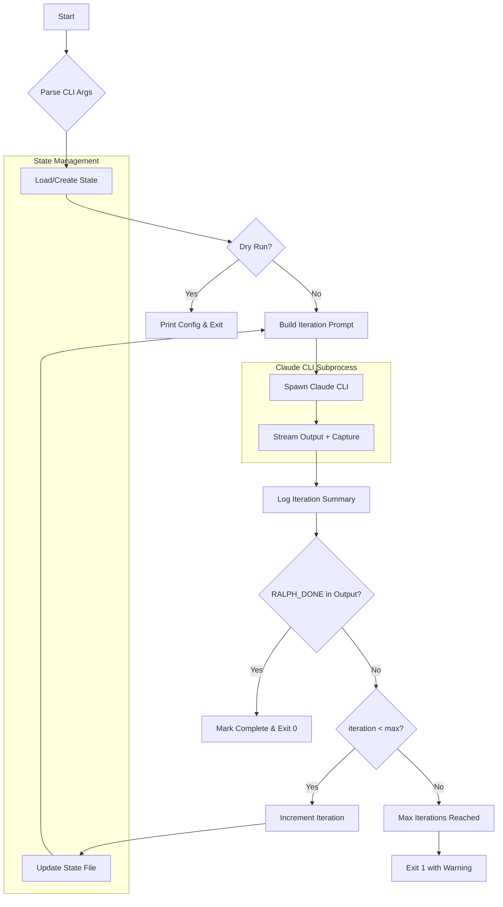

# Ralph Loop Implementation Plan

**Issue:** #161 - feat: add ralph-loop TypeScript script for iterative Claude Code execution
**Created:** 2026-01-08
**Status:** Complete

## Summary

Create `scripts/ralph-loop.ts` - a TypeScript script that runs Claude Code CLI in a loop until task completion, with fresh context each iteration and JSON state persistence.

## Codebase Context

### Existing Script Patterns

From `scripts/worktree.ts` and other scripts:
- Shebang: `#!/usr/bin/env -S pnpx tsx`
- Use `zx` for shell execution (`$`, `fs`, `chalk`)
- Manual argument parsing (no yargs/commander)
- Async/await throughout
- State persistence via JSON files (see worktree registry pattern)
- Interactive prompts via `question()` from zx
- Table output via `cli-table3`

### Relevant Existing Code

| File | Pattern |
|------|---------|
| `scripts/worktree.ts` | JSON registry, interactive CLI, slot system |
| `scripts/build.ts` | Subprocess spawning, async command execution |
| `packages/evals/run-eval.ts` | CLI subprocess with `execFileSync` |
| `packages/towles-tool/tt-core/commands/create_ralph_implement_command.md` | Ralph iteration concept with `--completion-promise` |

### Dependencies Available

```json
{
  "zx": "^8.8.5",
  "tsx": "^4.21.0",
  "chalk": "included in zx",
  "cli-table3": "^0.6.5"
}
```

## Expert Recommendations

### Claude CLI Usage

Per [Claude Code CLI documentation](https://docs.anthropic.com/en/docs/claude-code):
- `--print` flag outputs to stdout without interactive mode
- `--output-format stream-json` outputs newline-delimited JSON events
- `--include-partial-messages` includes streaming text deltas
- `--dangerously-skip-permissions` bypasses permission prompts for automation
- Exit codes: 0 = success, non-zero = error
- No built-in "done" signaling - requires output pattern matching

### Stream JSON Parsing

The script parses streaming JSON events to extract readable text:
- `content_block_delta` events contain incremental text in `event.delta.text`
- `result` events contain the final output summary
- Non-JSON lines are passed through as-is

### Subprocess Best Practices

From Node.js docs and ZX patterns:
- Use `$` from zx for shell commands with proper escaping
- Capture stdout/stderr separately for parsing
- Handle SIGINT/SIGTERM for graceful shutdown
- Set reasonable process limits

### State Machine Pattern

For iteration loops with state:
1. Load state → 2. Execute → 3. Parse output → 4. Update state → 5. Check completion → repeat

## Recommended Approach

### Core Architecture

```
┌─────────────────────────────────────────────────────────────┐
│                     ralph-loop.ts                           │
├─────────────────────────────────────────────────────────────┤
│  CLI Parser                                                 │
│  ├── --task "prompt"                                        │
│  ├── --task-file path.md                                    │
│  ├── --max-iterations 10 (default)                          │
│  ├── --dry-run                                              │
│  └── --claude-args "extra flags"                            │
├─────────────────────────────────────────────────────────────┤
│  State Manager                                              │
│  ├── Load ralph-state.json                                  │
│  ├── Update after each iteration                            │
│  └── Track: task, iteration, progress[], output             │
├─────────────────────────────────────────────────────────────┤
│  Execution Loop                                             │
│  ├── Build prompt with state context                        │
│  ├── Spawn: claude --print --output-format stream-json ...  │
│  ├── Stream output to console + capture                     │
│  ├── Parse for RALPH_DONE marker                            │
│  └── Log iteration summary                                  │
├─────────────────────────────────────────────────────────────┤
│  Completion Detection                                       │
│  ├── Check for RALPH_DONE in output                         │
│  ├── Check iteration < max-iterations                       │
│  └── Exit with appropriate code                             │
└─────────────────────────────────────────────────────────────┘
```

### State File Format (ralph-state.json)

```json
{
  "version": 1,
  "task": "Original task description",
  "startedAt": "2026-01-08T10:00:00Z",
  "iteration": 3,
  "maxIterations": 10,
  "status": "running",
  "history": [
    {
      "iteration": 1,
      "startedAt": "2026-01-08T10:00:00Z",
      "completedAt": "2026-01-08T10:02:30Z",
      "outputSummary": "Analyzed codebase, identified 5 files to modify",
      "markerFound": false
    },
    {
      "iteration": 2,
      "startedAt": "2026-01-08T10:02:31Z",
      "completedAt": "2026-01-08T10:05:00Z",
      "outputSummary": "Modified 3 files, tests passing",
      "markerFound": false
    }
  ]
}
```

### Prompt Template

Each iteration receives:

```
Continue working on the following task. Your state from previous iterations is provided.

## Task
{original task}

## Current State
{JSON state object}

## Instructions
- Continue where the previous iteration left off
- Update progress as you work
- When the task is FULLY COMPLETE, output the marker: RALPH_DONE
- Do not output RALPH_DONE until all work is finished and verified
```

### Mermaid Diagram



## Implementation TODOs

### Phase 1: Core Script Structure
- [x] Create `scripts/ralph-loop.ts` with shebang and imports
- [x] Implement CLI argument parsing (--task, --task-file, --max-iterations, --dry-run, --claude-args)
- [x] Add TypeScript interfaces for State and Config
- [x] Implement state file load/save functions

### Phase 2: Execution Loop
- [x] Build iteration prompt with state context
- [x] Implement Claude CLI spawning with zx
- [x] Stream output to console while capturing
- [x] Parse output for RALPH_DONE marker
- [x] Log iteration summary between runs

### Phase 3: Completion & Polish
- [x] Handle graceful shutdown (SIGINT/SIGTERM)
- [x] Add --dry-run mode showing config without execution
- [x] Add colored console output (iteration #, status, summary)
- [x] Add package.json script entry: `"ralph": "pnpm tsx scripts/ralph-loop.ts"`

### Phase 4: Testing
- [x] Manual test with simple task
- [x] Test max-iterations limit
- [x] Test RALPH_DONE detection
- [x] Test --dry-run mode

## CLI Interface

```bash
# Basic usage
./scripts/ralph-loop.ts --task "implement feature X"

# With options
./scripts/ralph-loop.ts --task "fix all lint errors" --max-iterations 5

# From file
./scripts/ralph-loop.ts --task-file tasks/my-task.md --max-iterations 20

# Dry run
./scripts/ralph-loop.ts --task "test" --dry-run

# Extra Claude flags
./scripts/ralph-loop.ts --task "explore codebase" --claude-args "--model opus"
```

## Exit Codes

| Code | Meaning |
|------|---------|
| 0 | Task completed (RALPH_DONE found) |
| 1 | Max iterations reached without completion |
| 2 | Invalid arguments / configuration error |
| 130 | Interrupted (SIGINT) |

## Files to Create/Modify

| File | Action |
|------|--------|
| `scripts/ralph-loop.ts` | Create - main script |
| `package.json` | Modify - add "ralph" script |

## Risks & Mitigations

| Risk | Mitigation |
|------|------------|
| Claude CLI not installed | Check for `claude` in PATH at startup, error clearly |
| Runaway iterations | --max-iterations with default 10 |
| State file corruption | Validate JSON on load, backup before write |
| Process hangs | User can Ctrl+C; no built-in timeout per decision |
