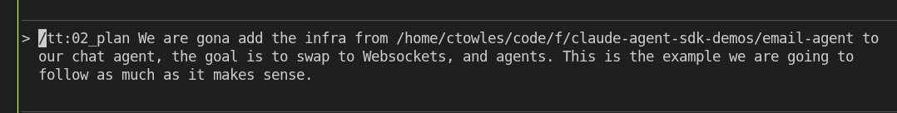

# Plan: WebSocket + Agent SDK Chat Migration

**Date**: 2026-01-04
**Branch**: `feature/156-agents-in-chat`
**Reference**: `/home/ctowles/code/f/claude-agent-sdk-demos/email-agent`

## Made with: 




## Summary

Replace the current SSE-based chat implementation with WebSocket streaming using the Claude Agent SDK. Implement an orchestrator pattern with 3 specialized subagents (Search, Weather, General). Port the email-agent's manager architecture (Session, Actions, UIState) adapted for blog context.

## Key Decisions

| Decision | Choice |
|----------|--------|
| Server Architecture | Nuxt integrated (crossws/nitro) |
| Migration Strategy | Hard cutover (replace SSE entirely) |
| Agent Scope | MCP tools only (RAG, weather, dice, author) |
| WS Runtime | crossws/nitro experimental |
| Frontend Streaming | Adapt existing `useChat()` composable |
| Session Persistence | Full resume (SDK session ID in DB) |
| Manager Complexity | Full architecture (Session, Actions, UIState) |
| Extended Thinking | Collapsible in UI (user toggle to view) |
| Timeout Handling | Chunked streaming with heartbeat |
| Actions/Listeners | Actions only (user-triggered buttons) |
| Agent Pattern | Orchestrator + 3 subagents from start |
| Error UX | Inline error messages in chat |
| Subagents | Search + Weather + General (3 agents) |
| Session Storage | Add `sdk_session_id` column to chats table |

---

## Phase 1: Infrastructure Setup

### 1.1 Database Migration
- [ ] Add `sdk_session_id` column to `chats` table (nullable TEXT)
- [ ] Run migration on local/staging

### 1.2 Install Dependencies
- [ ] Add `@anthropic-ai/claude-agent-sdk` to packages/blog
- [ ] Add `crossws` for Nitro WebSocket support
- [ ] Verify Nuxt experimental WS config

### 1.3 Create Directory Structure
```
packages/blog/server/
├── ccsdk/                    # Claude Code SDK adapters
│   ├── session.ts            # Session manager (port from email-agent)
│   ├── ai-client.ts          # Agent SDK wrapper
│   ├── websocket-handler.ts  # WS connection manager
│   ├── actions-manager.ts    # User-triggerable actions
│   ├── ui-state-manager.ts   # Reactive UI state
│   └── types.ts              # Shared types
├── agents/                   # Subagent definitions
│   ├── orchestrator.ts       # Main routing agent
│   ├── search-agent.ts       # Blog RAG search
│   ├── weather-agent.ts      # Weather API
│   └── general-agent.ts      # Fallback assistant
└── routes/
    └── ws.ts                 # WebSocket endpoint
```

---

## Phase 2: Core SDK Integration

### 2.1 Port Session Manager
- [ ] Adapt `email-agent/ccsdk/session.ts` for Nuxt
- [ ] Replace Bun SQLite with Drizzle ORM
- [ ] Implement message queue for ordered processing
- [ ] Add SDK session ID tracking for resume
- [ ] Handle multi-turn conversations

### 2.2 Port AI Client
- [ ] Create `ai-client.ts` wrapper around Agent SDK `query()`
- [ ] Configure with blog-specific system prompt
- [ ] Set up MCP server for existing tools (searchBlogContent, etc)
- [ ] Implement async generator streaming
- [ ] Add heartbeat messages every 15s to prevent Cloud Run timeout

### 2.3 WebSocket Handler (Nitro)
- [ ] Create `/server/routes/ws.ts` using crossws
- [ ] Handle connection lifecycle (open/close/error)
- [ ] Route message types: `chat`, `subscribe`, `execute_action`
- [ ] Broadcast patterns for multi-client sync
- [ ] Session ID generation and management

---

## Phase 3: Agent Architecture

### 3.1 Orchestrator Agent
- [ ] Create `orchestrator.ts` with routing logic
- [ ] Query classification (blog topic? weather? general?)
- [ ] Subagent delegation with context passing
- [ ] Result aggregation and formatting
- [ ] System prompt for routing decisions

### 3.2 Search Agent (Blog RAG)
- [ ] Port existing `searchBlogContent` tool
- [ ] Configure with search-specific prompt
- [ ] Access to: searchBlogContent, getBlogTopics, getAuthorInfo
- [ ] Model: Sonnet (fast, cost-effective)

### 3.3 Weather Agent
- [ ] Port existing `getWeather` tool
- [ ] Access to: getWeather, getCurrentDateTime
- [ ] Model: Haiku (simple queries)

### 3.4 General Agent
- [ ] Fallback for non-specialized queries
- [ ] Access to: rollDice, getCurrentDateTime, getAuthorInfo
- [ ] Model: Sonnet
- [ ] Conversational, helpful tone

---

## Phase 4: Manager Classes

### 4.1 Actions Manager
- [ ] Port `actions-manager.ts` from email-agent
- [ ] Define action templates for blog context:
  - "Search for similar posts"
  - "Summarize current topic"
  - "Show weather"
- [ ] Action instance lifecycle
- [ ] Execution context with tool access

### 4.2 UI State Manager
- [ ] Port `ui-state-manager.ts`
- [ ] Adapt for Vue reactivity patterns
- [ ] State persistence in PostgreSQL (or memory for session-scoped)
- [ ] Broadcast state changes to connected clients

### 4.3 Types & Contracts
- [ ] Define `WSMessage` types (incoming/outgoing)
- [ ] Define `AgentMessage` types matching SDK output
- [ ] Define `ActionTemplate` and `ActionInstance` types
- [ ] Shared types for frontend/backend

---

## Phase 5: Frontend Integration

### 5.1 Adapt useChat() Composable
- [ ] Replace SSE `EventSource` with `WebSocket`
- [ ] Handle WS message types:
  - `assistant_message` → append text
  - `tool_use` / `tool_result` → update tool state
  - `result` → mark complete
  - `error` → inline error display
- [ ] Reconnection logic with exponential backoff
- [ ] Session resume on page reload

### 5.2 Extended Thinking UI
- [ ] Add collapsible thinking section to message component
- [ ] Toggle visibility (default collapsed)
- [ ] Stream thinking content in real-time
- [ ] Visual indicator when thinking is happening

### 5.3 Action Buttons
- [ ] Render action buttons from `action_templates` message
- [ ] Send `execute_action` on click
- [ ] Show loading state during execution
- [ ] Display action results inline

### 5.4 Error Handling
- [ ] Inline error messages as assistant responses
- [ ] Retry suggestion in error message
- [ ] Graceful degradation on WS disconnect

---

## Phase 6: Infrastructure & Deployment

### 6.1 Cloud Run Config
- [ ] Update Terraform: increase request timeout to 300s
- [ ] Ensure WebSocket support enabled
- [ ] Add health check for WS endpoint

### 6.2 Heartbeat/Keepalive
- [ ] Server sends heartbeat every 15s
- [ ] Client responds to keep connection alive
- [ ] Auto-reconnect on heartbeat timeout

### 6.3 Testing
- [ ] Unit tests for Session manager
- [ ] Unit tests for orchestrator routing logic
- [ ] Integration test for WS endpoint
- [ ] E2E test for full chat flow

---

## Phase 7: Cleanup & Polish

### 7.1 Remove SSE Implementation
- [ ] Delete `/server/api/chats/[id].post.ts` (SSE endpoint)
- [ ] Remove SSE-specific code from `useChat()`
- [ ] Update any API clients using SSE

### 7.2 Documentation
- [ ] Update CLAUDE.md with new architecture
- [ ] Document WS message protocol
- [ ] Add troubleshooting guide for WS issues

### 7.3 Monitoring
- [ ] Add logging for agent routing decisions
- [ ] Track token usage per subagent
- [ ] Monitor WS connection lifecycle

---

## File Changes Summary

### New Files
- `packages/blog/server/ccsdk/session.ts`
- `packages/blog/server/ccsdk/ai-client.ts`
- `packages/blog/server/ccsdk/websocket-handler.ts`
- `packages/blog/server/ccsdk/actions-manager.ts`
- `packages/blog/server/ccsdk/ui-state-manager.ts`
- `packages/blog/server/ccsdk/types.ts`
- `packages/blog/server/agents/orchestrator.ts`
- `packages/blog/server/agents/search-agent.ts`
- `packages/blog/server/agents/weather-agent.ts`
- `packages/blog/server/agents/general-agent.ts`
- `packages/blog/server/routes/ws.ts`

### Modified Files
- `packages/blog/server/database/schema.ts` (add sdk_session_id)
- `packages/blog/app/composables/useChat.ts` (SSE → WS)
- `packages/blog/app/components/chat/MessageItem.vue` (thinking toggle)
- `packages/blog/nuxt.config.ts` (enable experimental WS)
- `infra/terraform/modules/cloud-run/main.tf` (timeout config)

### Deleted Files
- `packages/blog/server/api/chats/[id].post.ts`

---

## Risks & Mitigations

| Risk | Mitigation |
|------|------------|
| crossws/nitro experimental issues | Fall back to H3 manual upgrade if needed |
| Cloud Run WS termination | Heartbeat every 15s, auto-reconnect client |
| Agent routing accuracy | Start simple, log all decisions, iterate |
| Token cost increase (~4x) | Use Haiku/Sonnet for subagents, cache routing |
| Session resume failures | Graceful fallback to fresh session |

---

## Success Criteria

1. **Functional**: Chat works via WebSocket, multi-turn resume works
2. **Performance**: First message latency ≤ current SSE implementation
3. **Reliability**: Auto-reconnect handles network blips
4. **UX**: Thinking is collapsible, errors shown inline
5. **Cost**: Token usage within 5x of current (due to orchestration)
