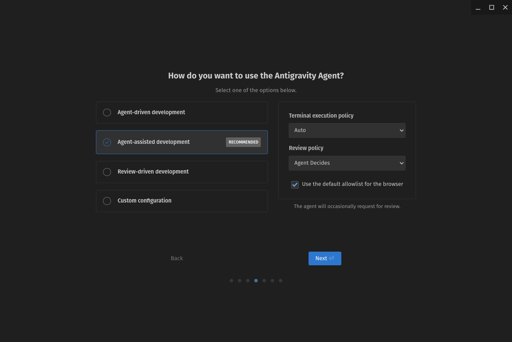
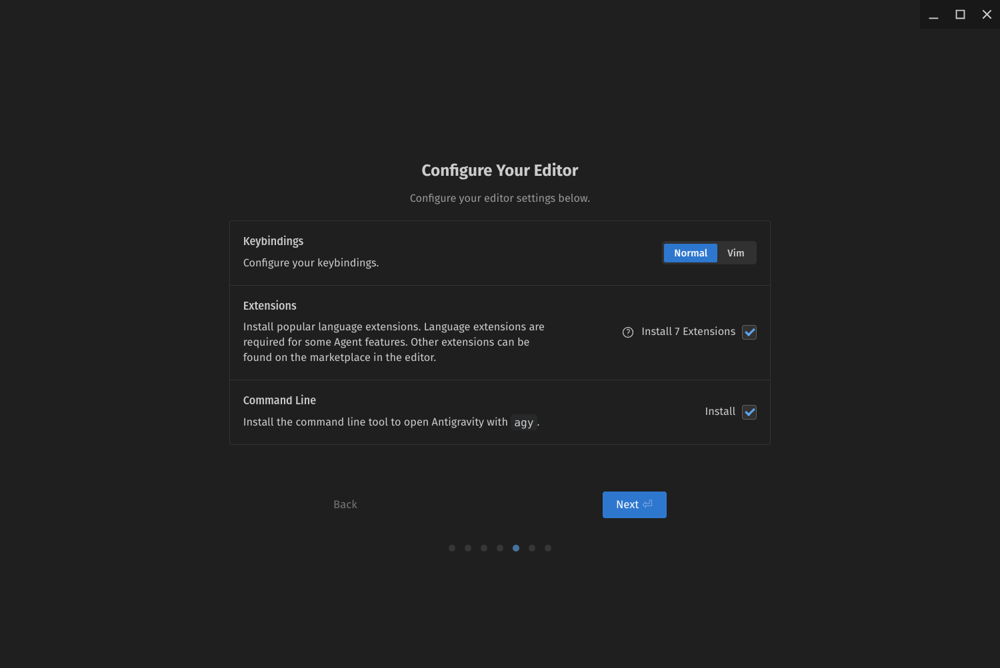
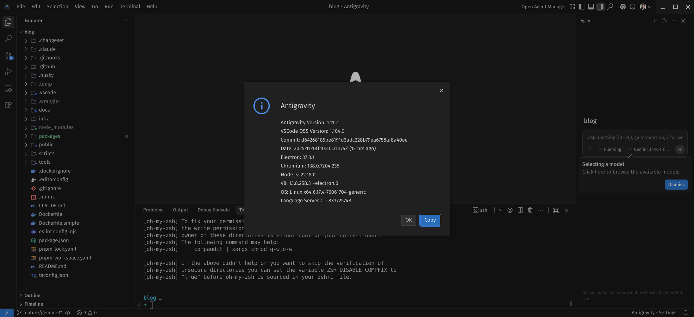
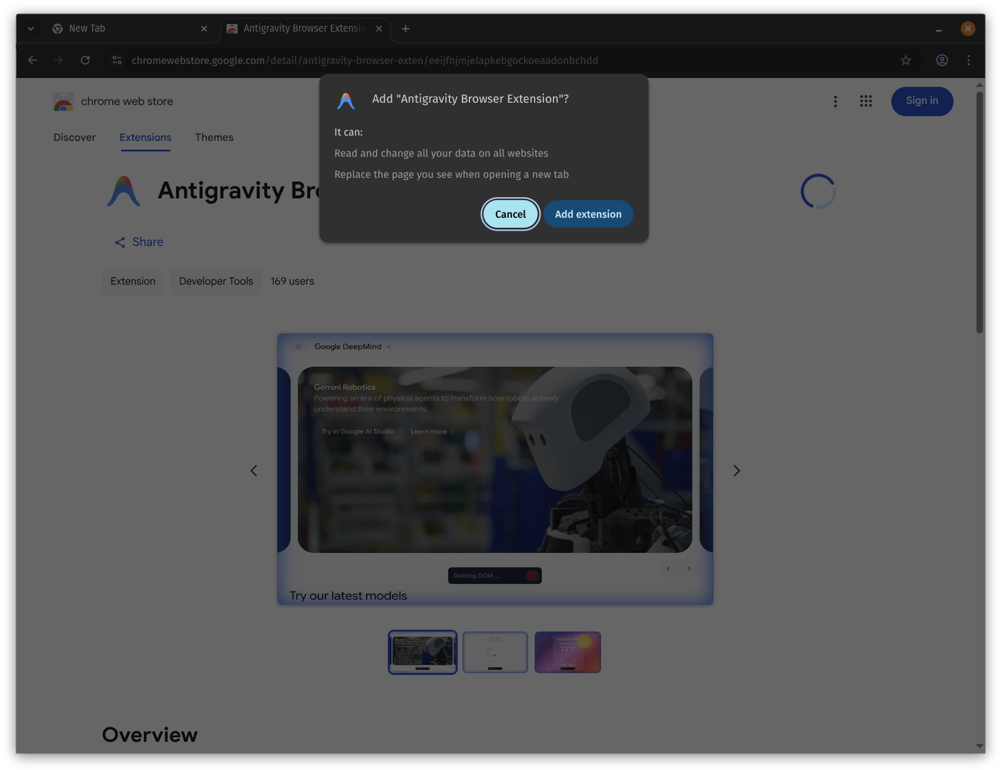

## Breaking: Google Just Launched Antigravity

Google announced [Gemini 3 Pro](https://docs.cloud.google.com/vertex-ai/generative-ai/docs/models/gemini/3-pro) and [Google Antigravity](https://antigravity.google/) this morning—November 18, 2025.

I'm writing this as I test it.

After Andrej Karpathy's [tweet](https://x.com/karpathy/status/1990854771058913347) sparked my interest in taking gemini 3 pro for a test drive as my daily driver. I'm exploring agentic AI coding in general i thought i'd combine the model with Google's full IDE with autonomous agents that have direct access to your editor, terminal, and browser.

I've tried GitHub Copilot, Cursor, the Gemini CLI, and Windsurf. None were more productive than Claude Code. I'm testing Antigravity to see if it changes that—specifically for multi-agent management.

## What Google Antigravity Actually Is

Antigravity is an AI IDE powered by Gemini 3, Claude Sonnet 4.5, and GPT-OSS (yes, you can choose your model).

Two modes:
- **Editor View**: Inline AI assistance, like every other AI IDE
- **Manager View**: Multiple autonomous agents working simultaneously

The "agent-first architecture" means agents aren't just chatbots—they control the editor, terminal, and browser directly. They create "artifacts" (task lists, implementation plans, screenshots) that are easier to verify than raw tool calls.

Free public preview. Available for Linux, macOS, Windows.

Source: https://antigravity.google

## Installation on Linux

Install was easy, register the keyring, then installed via apt. Launched with `antigravity` command.

Installation took about 3 minutes total.

I chose the recommended defaults:
- **Agent mode**: Agent-assisted development (recommended)
- **Terminal execution**: Auto
- **Review policy**: Agent Decides
- **Browser allowlist**: Enabled 

Then the default extensions installed.

Then logged in with my Google account.

## First Impressions: The Interface

So starting up Antigravity, you're greeted with a clean interface, which really means it's another VSCode fork with AI baked in. Not like i don't love VSCode, and if I were tasked to make a AI agent UI, its exactly what I'd do.

### Browser

So one interesting feature is the built-in browser. You can open a browser tab right in the IDE, and agents can use it to look up documentation or search the web.

### Agent Manager

The Agent Manager is where you can see and control all your autonomous agents. You can create new agents, assign them tasks, and monitor their progress.

This is a big differentiator from other AI coding tools. The ability to have multiple agents working on different parts of a project simultaneously could be a game-changer for complex tasks. Currently I'm using git worktrees to manage multiple branches, so having agents handle different branches or features could streamline my workflow.

### Editor View

[TODO: How does inline assistance work? How does it compare to Claude Code or Cursor?]

### Manager View

[TODO: What does "multiple autonomous agents" actually look like in practice? How do you coordinate them?]

<!-- Screenshot: Manager View with multiple agents -->

## Testing Real Coding Tasks

I gave Antigravity the same tasks I normally handle with Claude Code.

### Task 1: [TODO: Describe your first test]

[TODO: Add what you asked it to do, what happened, how well it worked]

**What worked:**
- [TODO]

**What didn't:**
- [TODO]

### Task 2: [TODO: Describe your second test]

[TODO: Add your experience]

## Agent Autonomy in Practice

The big question: What does "autonomous agents" actually mean?

[TODO: Test scenarios where agents work independently:
- Can they handle multi-step tasks without constant guidance?
- Do they validate their own work effectively?
- How do you manage multiple agents at once?
- What happens when they conflict or make mistakes?]

<!-- Screenshot: Example of agent artifacts - task lists, plans, etc. -->

## Gemini 3 Coding Ability

Google claims Gemini 3 Pro hits 1501 on LMArena with PhD-level reasoning scores.

[TODO: In practice, how does the code quality compare to:
- Claude Sonnet 4.5 (which you can also use in Antigravity)
- Your experience with other models
- Specific examples of good/bad suggestions]

## The Claude Code Comparison

I use Claude Code extensively. Here's how Antigravity stacks up:

**Installation:**
[TODO: Which was easier to set up?]

**UI/UX:**
[TODO: Which interface feels more natural for your workflow?]

**Agent Coordination:**
[TODO: Does Manager View actually improve multi-agent tasks, or is it complexity without benefit?]

**Code Quality:**
[TODO: Compare the actual output quality]

**Speed:**
[TODO: Which is faster for real work?]

**Context Management:**
[TODO: How do they handle large codebases and maintaining context?]

## What Surprised Me

[TODO: What unexpected things did you discover—good or bad?]

## The Real Question: Should You Switch?

After [X hours] of testing, here's my honest take:

**Use Antigravity if:**
[TODO: Based on your experience, what specific scenarios make it worth using?]

**Stick with Claude Code if:**
[TODO: Where does Claude Code still win?]

**Try both if:**
[TODO: When might you use each tool for different tasks?]

## What I'm Still Testing

This is a first look, not a comprehensive review. Things I need more time with:

- [TODO: Long-term reliability]
- [TODO: Complex multi-agent scenarios]
- [TODO: Performance on large codebases]
- [TODO: Edge cases and error handling]

## Final Thoughts

[TODO: Your honest bottom-line assessment after initial testing]

Google's timing is interesting—dropping this the same day as the announcement. It's either confidence or hype. I'm testing which one it is.

I'll update this post as I learn more.

## Resources

- Google Antigravity: https://antigravity.google
- Gemini 3 announcement: https://blog.google/products/gemini/gemini-3/
- Andrej Karpathy's original post: https://x.com/karpathy/status/1990854771058913347

---

**Update Log:**
- 2025-11-18: Initial testing and first impressions
- [TODO: Add updates as you test more]
