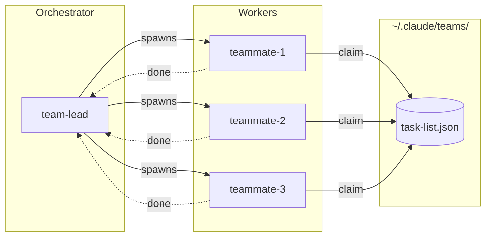
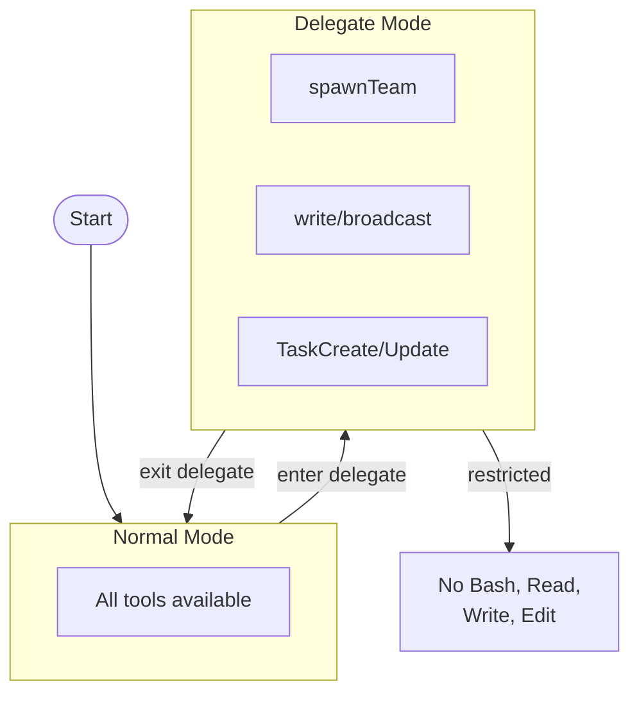
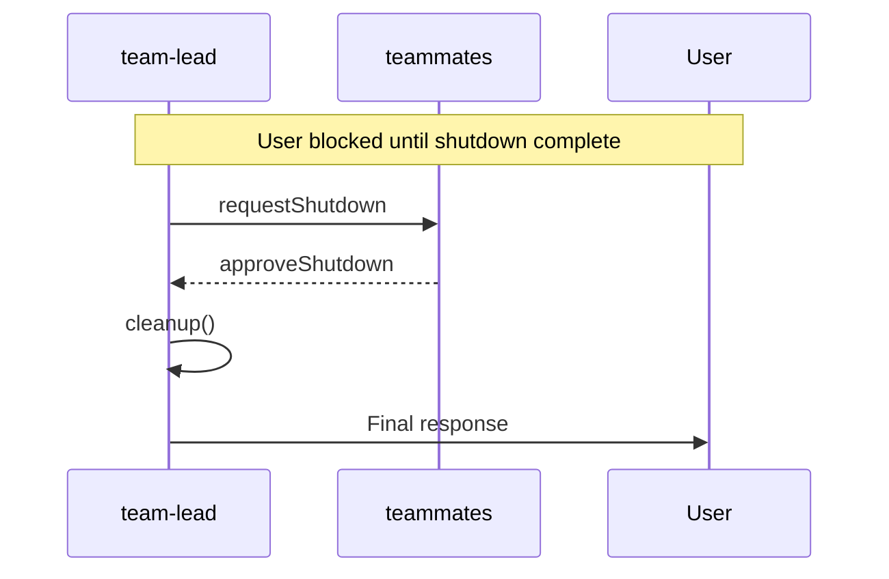

Spining up agent swarms are everywhere right now. Wilson Lin showed us with [FastRender](https://github.com/wilsonzlin/fastrender) that an agent swarm could even build a web browser from scratch! The whole ecosystem is converging on multi-agent architectures for complex tasks. So when I saw a tweet claiming Claude Code already has a hidden multi-agent system baked in, my first thought wasn't "no way" - it was "already?"

Turns out: yes. Already.

## The Claim

[Kieran Klaassen](https://x.com/kieranklaassen/status/2014830266515382693) posted on January 23rd:

> I think I found a hidden Claude Code feature! TLDR: It's a built‑in multi‑agent team system in Claude Code. TeammateTool lets you create teams, let agents join, message each other, approve plans, and shut down the team — but it's feature‑flagged and not enabled for most users yet.

He included a [gist documenting what he found](https://gist.github.com/kieranklaassen/d2b35569be2c7f1412c64861a219d51f) by running `strings` on the Claude Code binary. Bold claim. Let's verify it.

## The Verification

I couldn't just trust the tweet, sorry Kieran, so i had to verify!

Claude Code stores its binaries in `~/.local/share/claude/versions/`. I'm running v2.1.19:

```bash
$ strings ~/.local/share/claude/versions/2.1.19 | grep -E "CLAUDE_CODE_(TEAM|AGENT)" | sort -u
CLAUDE_CODE_AGENT_ID
CLAUDE_CODE_AGENT_NAME
CLAUDE_CODE_AGENT_SWARMS
CLAUDE_CODE_AGENT_TYPE
CLAUDE_CODE_TEAMMATE_COMMAND
CLAUDE_CODE_TEAM_NAME
CLAUDE_CODE_PLAN_MODE_REQUIRED
CLAUDE_CODE_SUBAGENT_MODEL
```

That's not accidental naming. Let's dig deeper.

## What I Found

### The Prompts

Buried in the binary are complete system prompts for team members:

**Teammate Prompt:** (`strings $BINARY | grep -A 10 "You are a teammate in team"`)

```
You are a teammate in team "${teamName}".
**Your Identity:** Name: ${agentName}
**Team Resources:**
- Team config: ${teamConfigPath}
- Task list: ${taskListPath}
**Team Leader:** The team lead's name is "team-lead".
Send updates and completion notifications to them.
```

**Delegate Mode Prompt:** (`strings $BINARY | grep -A 10 "You are in delegate mode"`)

```
You are in delegate mode for team "${teamName}".
In this mode, you can ONLY use the following tools:
- TeammateTool: For spawning teammates, sending messages, and team coordination
- TaskCreate, TaskGet, TaskUpdate, TaskList

You CANNOT use any other tools (Bash, Read, Write, Edit, etc.)
until you exit delegate mode.
```

**Shutdown Protocol:** (`strings $BINARY | grep -A 10 "You are running in non-interactive"`)

```
You are running in non-interactive mode and cannot return
a response to the user until your team is shut down.

You MUST shut down your team before preparing your final response:
1. Use requestShutdown to ask each team member to shut down gracefully
2. Wait for shutdown approvals
3. Use the cleanup operation to clean up the team
```

### The Operations

The TeammateTool supports these operations:

- `spawnTeam` - Create a new team with task list
- `discoverTeams` - Find existing teams
- `requestJoin`, `approveJoin`, `rejectJoin` - Membership management
- `write` - Direct message to teammate
- `broadcast` - Message all teammates
- `requestShutdown`, `approveShutdown`, `rejectShutdown` - Graceful termination
- `approvePlan`, `rejectPlan` - Plan approval workflow
- `cleanup` - Team cleanup

### The Tier Gating

Found this in the binary:

```javascript
if (H === 'max' && $ === 'default_claude_max_20x') return 3;
if (H === 'enterprise' || H === 'team') return 3;
return 1;
```

Translation: Max and Enterprise tiers get 3 agents. Everyone else gets 1 (effectively disabled).

## The Architecture

Based on the code, here's how the system is structured:

### Team Structure



### Delegate Mode Flow



### Shutdown Protocol



## Verify It Yourself

Want to confirm this on your own machine? Here's how:

### Find Your Binary

```bash
# Check your version
claude --version

# Find where binaries live
ls ~/.local/share/claude/versions/
```

### Search for Team Functions

```bash
# Find environment variables
strings ~/.local/share/claude/versions/2.1.19 | grep -E "CLAUDE_CODE_(TEAM|AGENT)" | sort -u

# Find teammate prompts
strings ~/.local/share/claude/versions/2.1.19 | grep "You are a teammate"

# Find TeammateTool operations
strings ~/.local/share/claude/versions/2.1.19 | grep -E "spawnTeam|requestShutdown|broadcast"
```

### Check for Tier Gating

```bash
# Look for the agent count logic
strings ~/.local/share/claude/versions/2.1.19 | grep -E "max.*enterprise|AGENT_COUNT"
```

Replace `2.1.19` with your version number.

## What This Means

### It's Real and Complete

This isn't stub code or a prototype. The prompts are polished. The shutdown protocol is thoughtful - teammates can't just vanish, they have to gracefully terminate. There's a delegate mode that restricts the leader to coordination-only tools. This already looks pretty polished.

### The Design Reveals Intent

The architecture tells us what Anthropic thinks multi-agent workflow looks like and its very close to the Wilson Lin examples. (https://github.com/wilsonzlin/fastrender)

1. **Shared task list** - Teammates don't get private instructions. They pull from a common queue. This prevents the "telephone game" problem where agents pass increasingly garbled context to each other. Anthropic just [shipped this with Tasks](https://x.com/trq212/status/2014480496013803643) the day before Kieran's discovery: _"Tasks are stored in the file system so that multiple subagents or sessions can collaborate on them. When one session updates a Task, that is broadcasted to all sessions currently working on the same Task List."_

2. **Explicit coordination mode** - The team lead can't directly edit files while coordinating. They have to delegate. This enforces clean separation between orchestration and execution.

3. **Idle notifications** - Workers automatically ping the leader when they finish. The leader doesn't have to poll.

### Where This Is Going

With Tasks already shipping and TeammateTool waiting in the wings, the pieces are falling into place. The architecture is thoughtful - shared task queues, explicit coordination modes, idle notifications. Its elegant in its simpliestiy, matching observations from others like Cursor https://cursor.com/blog/scaling-agents
The future of AI coding isn't one agent doing everything sequentially. It's specialized agents collaborating on shared work, each doing what they're best at. And that future is closer than most people realize.

What are you shipping in 2026? [Why not today?](https://x.com/trq212/status/2010895204405092647)
