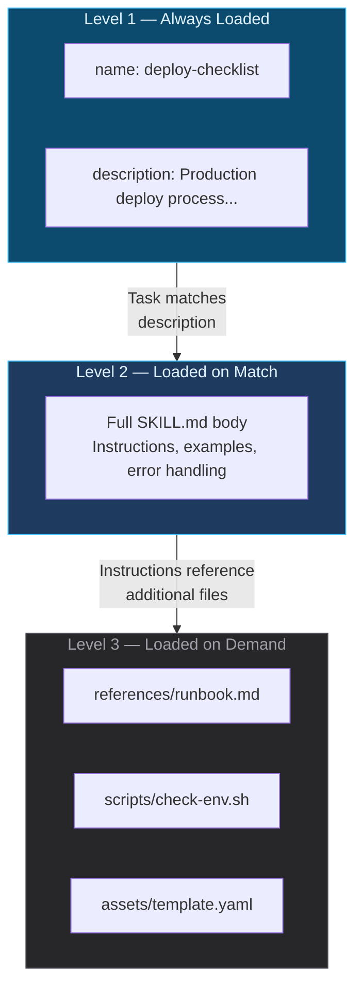
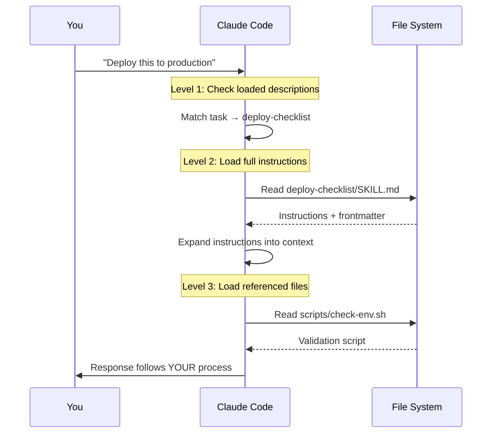

LLMs are impressive generalists. Ask Claude how to deploy a service and you'll get a solid, textbook answer — run tests, build artifacts, deploy, monitor. All correct. All useless if your team deploys by running integration tests against staging, getting sign-off from the on-call engineer, and canarying at 10% traffic for 30 minutes before full rollout.

The gap isn't intelligence. It's _your_ knowledge. The conventions, processes, and hard-won lessons that exist in your team's heads and nowhere else.

That's exactly what [Skills](https://www.anthropic.com/news/skills) solve.

> If you want the deep dive, Anthropic published a 32-page guide: [The Complete Guide to Building Skills for Claude (PDF)](https://resources.anthropic.com/hubfs/The-Complete-Guide-to-Building-Skill-for-Claude.pdf). It covers everything from architecture to distribution. This post distills the key concepts and adds a hands-on demo, but the official guide is worth reading cover to cover.

## What Are Skills?

A skill is a folder with a markdown file (`SKILL.md`) that tells Claude how to do something specific. That's it. Optionally, you add scripts, templates, or reference docs alongside it. When Claude encounters a task that matches a skill's description, it loads the instructions and follows your playbook instead of improvising.

Think of it like writing an onboarding guide for a new hire. You don't teach them "what programming is" — they already know that. You teach them _how your team does things_: the deploy checklist, the PR review process, the naming conventions that aren't written down anywhere.

### Skills vs CLAUDE.md vs MCP

These three pieces work together but serve different purposes:

- **CLAUDE.md** is identity and broad context — "this is a Nuxt 4 monorepo, here's our project structure, here are the commands"
- **MCP** is connectivity — giving Claude access to external tools and services
- **Skills** are procedural knowledge — step-by-step instructions for specific tasks

The official guide nails the analogy: **MCP gives Claude the professional kitchen** — access to tools, ingredients, and equipment. **Skills give it the recipes** — step-by-step instructions for creating something valuable. You need both. A kitchen without recipes produces inconsistent results. Recipes without a kitchen are just theory.

CLAUDE.md tells Claude _where it is_. MCP tells Claude _what it can reach_. Skills tell Claude _how to do the job your way_.

## Try It: Before and After

The best way to understand skills is to experience the difference. This interactive demo lets you write a skill with your own team's process and see how it changes Claude's response.

::skill-demo
::

That's the entire concept. You encoded knowledge Claude didn't have, and now it responds with _your_ process instead of a generic one.

## Progressive Disclosure: How Skills Stay Lean

The biggest question with skills is context cost. If Claude loads every skill's full instructions at startup, you'd burn through the context window before writing a line of code. Anthropic's solution is what the guide calls **progressive disclosure** — a three-level loading system:



**Level 1: Frontmatter only.** At startup, Claude loads just the `name` and `description` from every installed skill's YAML frontmatter. This costs roughly 50-100 tokens per skill — cheap enough to have dozens of skills available without impacting performance.

**Level 2: Full SKILL.md.** When Claude determines a skill matches the current task, it reads the complete SKILL.md body into context — instructions, examples, error handling, all of it.

**Level 3: Referenced files.** For complex skills, additional files in the skill directory — reference docs, API patterns, templates — are only loaded when the SKILL.md instructions explicitly reference them.

The guide reports that for complex project creation, this system reduced clarification questions from 15 to 2 and cut token consumption from 12,000 to 6,000. That's the difference between a skill that front-loads everything and one that progressively discloses only what's needed.

### Discovery Locations

When Claude Code starts, it scans for skills in multiple locations:

```
~/.claude/skills/          ← your global skills (personal workflows)
.claude/skills/            ← project skills (team workflows, checked into git)
plugins                    ← plugin-provided skills (from the marketplace)
```

A few details worth knowing:

- **Context budget**: skill descriptions share 2% of the context window (fallback of 16k characters). Run `/context` in Claude Code to check if any skills got excluded.
- **Monorepo support**: if you're working in `packages/frontend/`, Claude also discovers skills from `packages/frontend/.claude/skills/`. Each package can have its own skills.
- **Live reload**: skills in directories added via `--add-dir` are watched for changes. Edit a skill mid-session, and Claude picks it up without restarting.
- **Invocation**: Claude auto-matches skills to tasks, but you can also invoke them explicitly with `/skill-name`.

### What Happens When a Skill Triggers

When Claude decides a skill is relevant (or you invoke one with `/skill-name`), the execution flow maps directly to the progressive disclosure levels:



This is fundamentally different from tools. A tool executes and returns results. A skill _prepares_ Claude to solve the problem using your approach. The instructions become part of Claude's working context, shaping how it thinks about the task.

## Anatomy of a Skill

Every skill lives in its own directory under `.claude/skills/`:

```
.claude/skills/
└── deploy-checklist/
    ├── SKILL.md              ← required: instructions
    ├── scripts/
    │   └── check-env.sh      ← optional: executable scripts
    └── references/
        └── runbook.md        ← optional: detailed docs
```

### Folder and Naming Rules

- Folder names must be **kebab-case** (`deploy-checklist`, not `DeployChecklist`)
- No spaces, capitals, or underscores
- The `name` field in frontmatter should match the folder name

### SKILL.md Frontmatter

The YAML block at the top of `SKILL.md` is what Claude reads at Level 1. There are two required fields and several optional ones:

```yaml
---
# Required
name: deploy-checklist
description: >
  Production deployment process and pre-deploy verification.
  Use when deploying services, releasing to production, or
  running pre-deploy checks. Trigger on "deploy", "release",
  "ship it".

# Optional
license: MIT
compatibility: claude-code
metadata:
  author: your-team
  version: 1.0.0
  mcp-server: deployment-tools
---
```

The `description` field is the most important thing you'll write. It's the Level 1 content — what Claude reads to decide whether this skill is relevant. Be specific about what the skill does AND when it should trigger. Include the phrases users would actually say.

**Security note**: XML angle brackets (`<` `>`) are forbidden in frontmatter. The `name` field can't start with `claude` or `anthropic` (reserved).

### A Complete Example

Here's a deploy-checklist skill:

```yaml
---
name: deploy-checklist
description: Production deployment process and pre-deploy verification.
  Use when deploying services, releasing to production, or running
  pre-deploy checks. Trigger on "deploy", "release", "ship it".
---

# Production Deploy Checklist

## Pre-deploy Verification

1. Run the full integration suite:
   ```bash
   pnpm test:integration
   ```
2. Confirm staging smoke tests passed in CI
3. Verify the on-call engineer is available in #ops

## Deploy Process

1. Deploy to canary (10% traffic):
   ```bash
   pnpm deploy:canary
   ```
2. Monitor error rates in Datadog for 30 minutes
3. If error rate < 0.1%, proceed to full rollout:
   ```bash
   pnpm deploy:full
   ```
4. Post deploy confirmation in #releases

## Rollback

If error rate exceeds 0.5% at any stage:
```bash
pnpm deploy:rollback
```
Notify #ops immediately.
```

### A Minimal Skill

Skills don't have to be complex. Here's a useful one in 8 lines:

```yaml
---
name: pr-template
description: Pull request creation with our team's template and conventions.
  Use when creating PRs, opening pull requests, or preparing code for review.
---

# PR Conventions

- Title format: `[JIRA-123] Brief description` (under 70 chars)
- Always include a "Test Plan" section with manual verification steps
- Tag the `platform` team for infra changes, `frontend` for UI changes
- Screenshots required for any visual changes
```

That's a complete, useful skill. No scripts, no templates, no references. Just the knowledge that makes your team's PRs consistent.

## Three Patterns for Skills

The official guide identifies three primary patterns. Knowing which one you're building helps you scope it correctly.

### 1. Document & Asset Creation

Skills that produce consistent output — presentations, designs, reports, code scaffolds — following your exact standards. These work with Claude's built-in capabilities, no MCP required.

**Example**: a skill that generates your team's architecture decision records (ADRs) with the right template, naming convention, and approval sections.

### 2. Workflow Automation

Multi-step processes that need consistent methodology. These often coordinate several actions in sequence and may use MCP servers for external service access.

**Example**: a sprint planning skill that fetches project status, analyzes velocity, suggests priorities, and creates tasks in your project management tool.

### 3. MCP Enhancement

Layer expertise onto tool access. Your MCP server provides the connection to a service. The skill adds the _how_ — the workflows, error handling, and domain knowledge your team has built over years.

**Example**: you have an MCP server for your database. The skill adds knowledge about your team's migration conventions, naming standards, and rollback procedures.

## Five Design Patterns

Beyond the three use cases, the guide codifies recurring architectural patterns for skill internals:

1. **Sequential Workflow** — Ordered multi-step processes (onboarding, deployment, compliance checks)
2. **Multi-MCP Coordination** — Workflows spanning multiple services (design handoff from Figma to Linear to Slack)
3. **Iterative Refinement** — Output that improves through validation loops (report generation with quality checks)
4. **Context-Aware Selection** — Same outcome, different tools based on file type, size, or context
5. **Domain Intelligence** — Embedded specialized knowledge beyond tool access (financial compliance rules, security protocols)

Most real skills combine 2-3 of these. A deploy-checklist is sequential workflow + domain intelligence. A design-handoff skill is multi-MCP coordination + iterative refinement.

## Testing Your Skills

The guide is emphatic about one thing: **don't use vague instructions like "double check your work."** Use programmatic validation instead. Include scripts in the `scripts/` folder and tell Claude to run them.

Three levels of testing, depending on how critical the skill is:

1. **Manual testing in Claude.ai** — Run queries and observe behavior. Fast iteration, no setup. Good for prototyping.
2. **Scripted testing in Claude Code** — Automate test cases for repeatable validation. Good for team skills that need to work consistently.
3. **Programmatic testing via the Skills API** — Build evaluation suites that run systematically against defined test sets. Good for skills you distribute externally.

### What to Test

- **Triggering** — does the skill load when it should? Does it stay quiet when it shouldn't?
- **Functional correctness** — does it produce the right output?
- **Performance** — is it measurably better than no skill?

### KPIs Worth Tracking

The guide suggests three metrics:

- **Skill Trigger Rate** — target 90%+ accuracy on relevant queries. If your deploy skill only triggers 60% of the time when someone says "ship it," your description needs work.
- **API Call Success Rate** — target zero failed API calls per workflow. Especially relevant for MCP-enhanced skills.
- **Token Efficiency** — measure context reduction vs. putting everything in CLAUDE.md. The whole point of progressive disclosure is using fewer tokens for the same quality.

## Recommended Skills to Get Started

The ecosystem has grown fast since Anthropic [open-sourced the Agent Skills standard](https://www.anthropic.com/engineering/equipping-agents-for-the-real-world-with-agent-skills) in December 2025. Here are good starting points:

### Official: [anthropics/skills](https://github.com/anthropics/skills)

Anthropic's own repository has 50+ skills across categories like document processing, development tools, and data analysis. You can install them as plugins directly in Claude Code. The [skill-creator](https://github.com/anthropics/skills/blob/main/skills/skill-creator/SKILL.md) skill is particularly useful — it's a skill for building skills. The guide estimates 15-30 minutes to build and test your first working skill using it.

### Community

- **[travisvn/awesome-claude-skills](https://github.com/travisvn/awesome-claude-skills)** — curated list including [obra/superpowers](https://github.com/obra/superpowers), a collection of 20+ battle-tested skills for TDD, debugging, and collaboration patterns
- **[skillsmp.com](https://skillsmp.com)** — marketplace with thousands of community-created skills

### Cross-Platform

The Agent Skills format is now an [open standard](https://agentskills.io). The same SKILL.md files work across Claude Code, Claude.ai, the API, OpenAI's Codex CLI, VS Code, and Cursor. Write once, use everywhere.

## Build Your Own

The best skills encode knowledge that's unique to your team. Here's how to think about what to build:

**Ask yourself**: what do you explain to every new team member? That's a skill.

- How you structure database migrations
- Your team's error handling conventions
- The process for incident response
- How you name things (files, branches, variables)
- Your code review checklist

**Keep it focused**. One skill, one concern. A skill that tries to cover "all of our engineering practices" will be too large for the context window and too vague to be useful. A skill that covers "how we write database migrations" is perfect. The guide recommends keeping `SKILL.md` under 5,000 words — if you exceed that, offload detail to `references/` or split into a "skill pack."

**Write descriptions that trigger correctly**. Include both what the skill does and the actual phrases users would say. "Analyzes Figma designs and generates handoff docs. Use when uploading .fig files or asking for 'design specs' or 'component documentation'" is much better than "Figma design helper."

**Use programmatic validation, not vibes**. Instead of telling Claude to "verify the output looks correct," include a script in `scripts/` that actually checks it. Claude is good at running scripts. It's less good at judging its own work.

**Move references out of SKILL.md**. Keep the main file focused on instructions. Detailed documentation, API specs, and schema definitions go in a `references/` subdirectory. Claude reads them only when needed (Level 3).

### Common Pitfalls

The guide calls out several mistakes worth avoiding:

- **Vague descriptions** that never trigger or trigger on everything
- **Instructions buried in verbose content** — Claude works better with concise, direct instructions
- **Missing error handling** for MCP calls — always tell Claude what to do when an API call fails
- **Trying to do too much** in one skill — split it into a skill pack instead

## What's Next

Skills are still early but moving fast. The [official guide (PDF)](https://resources.anthropic.com/hubfs/The-Complete-Guide-to-Building-Skill-for-Claude.pdf) and the [Claude Code docs](https://code.claude.com/docs/en/skills) are the best sources of truth. But the core idea is durable: the most effective way to work with AI isn't better prompting, it's giving it the knowledge it needs upfront.

Your team's expertise shouldn't live only in people's heads. Write it down as a SKILL.md, drop it in `.claude/skills/`, and let Claude work the way your team works.

_What workflow will you teach Claude first?_
