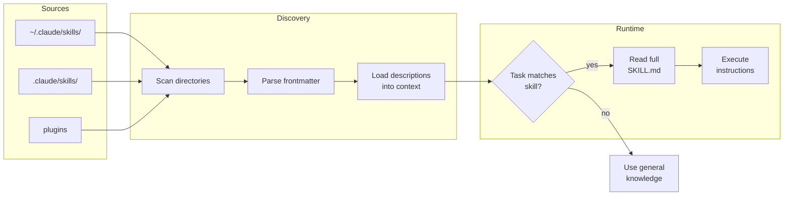
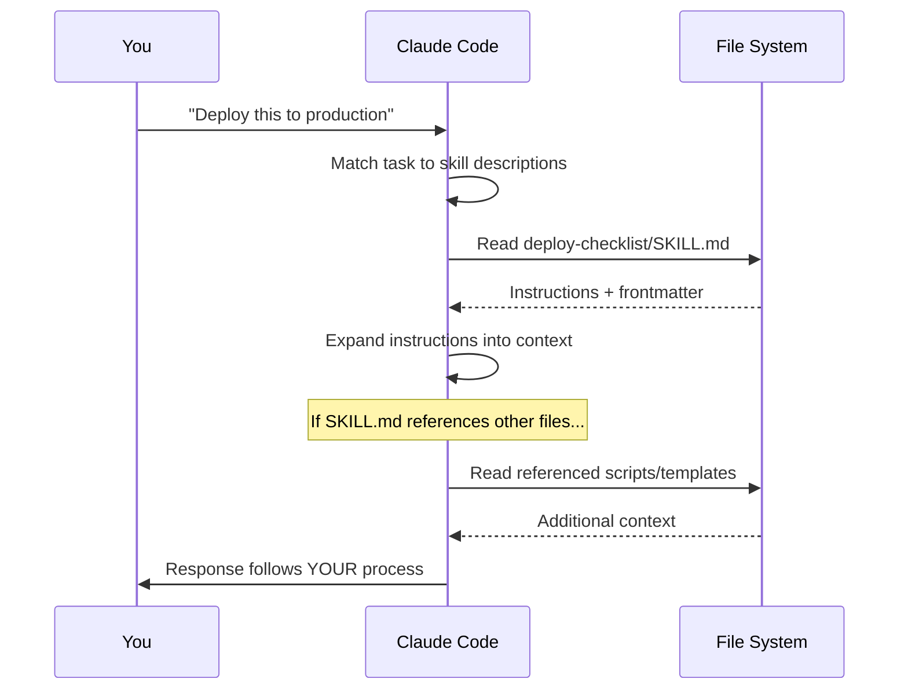

LLMs are impressive generalists. Ask Claude how to deploy a service and you'll get a solid, textbook answer — run tests, build artifacts, deploy, monitor. All correct. All useless if your team deploys by running integration tests against staging, getting sign-off from the on-call engineer, and canarying at 10% traffic for 30 minutes before full rollout.

The gap isn't intelligence. It's _your_ knowledge. The conventions, processes, and hard-won lessons that exist in your team's heads and nowhere else.

That's exactly what [Skills](https://www.anthropic.com/news/skills) solve.

## What Are Skills?

A skill is a folder with a markdown file (`SKILL.md`) that tells Claude how to do something specific. That's it. Optionally, you add scripts, templates, or reference docs alongside it. When Claude encounters a task that matches a skill's description, it loads the instructions and follows your playbook instead of improvising.

Think of it like writing an onboarding guide for a new hire. You don't teach them "what programming is" — they already know that. You teach them _how your team does things_: the deploy checklist, the PR review process, the naming conventions that aren't written down anywhere.

[Simon Willison put it well](https://simonwillison.net/2025/Oct/16/claude-skills/): Claude Code isn't purely a coding tool — it's a general agent. Skills make this obvious and explicit.

### Skills vs CLAUDE.md vs MCP

These three pieces work together but serve different purposes:

- **CLAUDE.md** is identity and broad context — "this is a Nuxt 4 monorepo, here's our project structure, here are the commands"
- **MCP** is connectivity — giving Claude access to external tools and services
- **Skills** are procedural knowledge — step-by-step instructions for specific tasks

CLAUDE.md tells Claude _where it is_. MCP tells Claude _what it can reach_. Skills tell Claude _how to do the job your way_.

## Try It: Before and After

The best way to understand skills is to experience the difference. This interactive demo lets you write a skill with your own team's process and see how it changes Claude's response.

::skill-demo
::

That's the entire concept. You encoded knowledge Claude didn't have, and now it responds with _your_ process instead of a generic one.

## How Discovery Works

When you start Claude Code, it scans for skills in multiple locations:

```
~/.claude/skills/          ← your global skills (personal workflows)
.claude/skills/            ← project skills (team workflows, checked into git)
plugins                    ← plugin-provided skills (from the marketplace)
```

For each skill directory, Claude reads the `SKILL.md` frontmatter — just the `name` and `description` fields — and loads those summaries into context. This is how Claude knows what skills are available without reading every instruction upfront.



A few details worth knowing:

- **Context budget**: skill descriptions share 2% of the context window (fallback of 16k characters). Run `/context` in Claude Code to check if any skills got excluded.
- **Monorepo support**: if you're working in `packages/frontend/`, Claude also discovers skills from `packages/frontend/.claude/skills/`. Each package can have its own skills.
- **Live reload**: skills in directories added via `--add-dir` are watched for changes. Edit a skill mid-session, and Claude picks it up without restarting.
- **Invocation**: Claude auto-matches skills to tasks, but you can also invoke them explicitly with `/skill-name`.

### What Happens When a Skill Triggers

When Claude decides a skill is relevant (or you invoke one with `/skill-name`), the execution flow is straightforward:



This is fundamentally different from tools. A tool executes and returns results. A skill _prepares_ Claude to solve the problem using your approach. The instructions become part of Claude's working context, shaping how it thinks about the task.

## Anatomy of a Skill

Every skill lives in its own directory under `.claude/skills/`:

```
.claude/skills/
└── deploy-checklist/
    ├── SKILL.md              ← required: instructions
    ├── scripts/
    │   └── check-env.sh      ← optional: executable scripts
    └── references/
        └── runbook.md        ← optional: detailed docs
```

The `SKILL.md` has two parts: YAML frontmatter and markdown body.

### A Complete Example

Here's a deploy-checklist skill:

```yaml
---
name: deploy-checklist
description: Production deployment process and pre-deploy verification.
  Use when deploying services, releasing to production, or running
  pre-deploy checks. Trigger on "deploy", "release", "ship it".
---

# Production Deploy Checklist

## Pre-deploy Verification

1. Run the full integration suite:
   ```bash
   pnpm test:integration
   ```
2. Confirm staging smoke tests passed in CI
3. Verify the on-call engineer is available in #ops

## Deploy Process

1. Deploy to canary (10% traffic):
   ```bash
   pnpm deploy:canary
   ```
2. Monitor error rates in Datadog for 30 minutes
3. If error rate < 0.1%, proceed to full rollout:
   ```bash
   pnpm deploy:full
   ```
4. Post deploy confirmation in #releases

## Rollback

If error rate exceeds 0.5% at any stage:
```bash
pnpm deploy:rollback
```
Notify #ops immediately.
```

The `description` field is critical — it's what Claude reads to decide whether this skill is relevant. Be specific about trigger words and use cases.

### A Minimal Skill

Skills don't have to be complex. Here's a useful one in 8 lines:

```yaml
---
name: pr-template
description: Pull request creation with our team's template and conventions.
  Use when creating PRs, opening pull requests, or preparing code for review.
---

# PR Conventions

- Title format: `[JIRA-123] Brief description` (under 70 chars)
- Always include a "Test Plan" section with manual verification steps
- Tag the `platform` team for infra changes, `frontend` for UI changes
- Screenshots required for any visual changes
```

That's a complete, useful skill. No scripts, no templates, no references. Just the knowledge that makes your team's PRs consistent.

## Recommended Skills to Get Started

The ecosystem has grown fast since Anthropic [open-sourced the Agent Skills standard](https://www.anthropic.com/engineering/equipping-agents-for-the-real-world-with-agent-skills) in December 2025. Here are good starting points:

### Official: [anthropics/skills](https://github.com/anthropics/skills)

Anthropic's own repository has 50+ skills across categories like document processing, development tools, and data analysis. You can install them as plugins directly in Claude Code. The [skill-creator](https://github.com/anthropics/skills/blob/main/skills/skill-creator/SKILL.md) skill is particularly useful — it's a skill for building skills.

### Community

- **[travisvn/awesome-claude-skills](https://github.com/travisvn/awesome-claude-skills)** — curated list including [obra/superpowers](https://github.com/obra/superpowers), a collection of 20+ battle-tested skills for TDD, debugging, and collaboration patterns
- **[skillsmp.com](https://skillsmp.com)** — marketplace with thousands of community-created skills

### Cross-Platform

The Agent Skills format is now an [open standard](https://agentskills.io). The same SKILL.md files work across Claude Code, OpenAI's Codex CLI, VS Code, and Cursor. Write once, use everywhere.

## Build Your Own

The best skills encode knowledge that's unique to your team. Here's how to think about what to build:

**Ask yourself**: what do you explain to every new team member? That's a skill.

- How you structure database migrations
- Your team's error handling conventions
- The process for incident response
- How you name things (files, branches, variables)
- Your code review checklist

**Keep it focused**. One skill, one concern. A skill that tries to cover "all of our engineering practices" will be too large for the context window and too vague to be useful. A skill that covers "how we write database migrations" is perfect.

**Move references out of SKILL.md**. Keep the main file focused on instructions. Detailed documentation, API specs, and schema definitions go in a `references/` subdirectory. Claude reads them only when needed.

**Remember the context window is shared**. Skills share space with everything else Claude needs — your code, conversation history, tool results. Only add context Claude doesn't already know. You don't need to explain what a database migration is. You need to explain that your team uses timestamped filenames and always includes a rollback script.

## What's Next

Skills are still early. Anthropic ships improvements regularly — the [official docs](https://code.claude.com/docs/en/skills) are the best source of truth. But the core idea is durable: the most effective way to work with AI isn't better prompting, it's giving it the knowledge it needs upfront.

Your team's expertise shouldn't live only in people's heads. Write it down as a SKILL.md, drop it in `.claude/skills/`, and let Claude work the way your team works.

_What workflow will you teach Claude first?_
