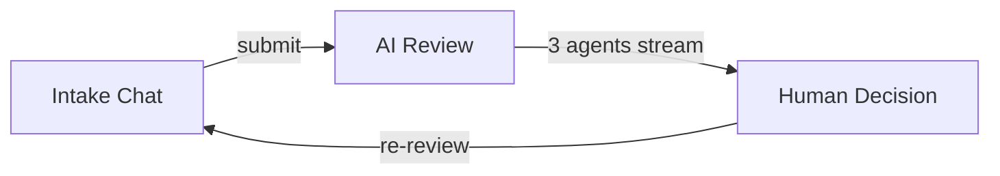
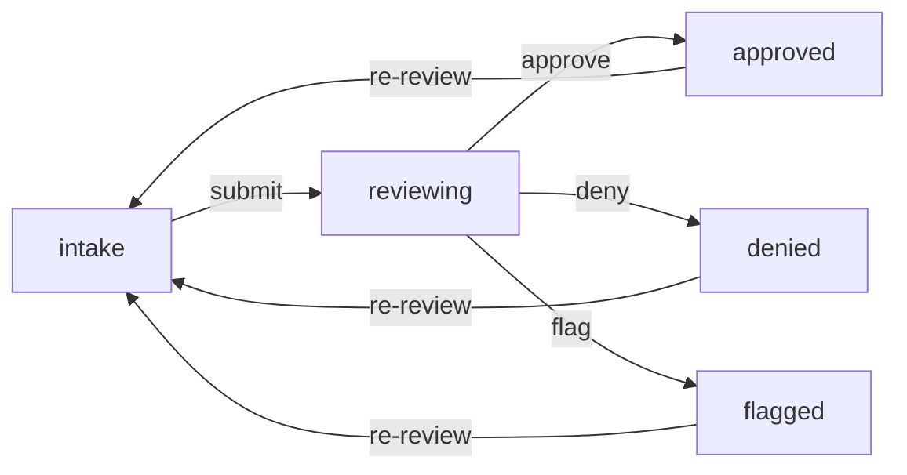

:::callout{icon="i-lucide-play"}
**[Try the demo](/loan)** — walk through the full workflow yourself. Requires GitHub login.
:::

## What I Built

A home loan application workflow where AI agents review applications but a human makes the final call. Three specialized AI reviewers analyze every application independently, then a human approves, denies, or flags it — the AI advises, it doesn't decide.

This is a demo/playground, not production financial software. But it demonstrates a pattern that matters: multi-agent AI systems that keep humans in the decision loop.

## The Flow



### 1. Intake — Conversational Data Collection

The applicant chats with an AI assistant that collects loan details naturally. No forms — just conversation. The AI uses tool calls behind the scenes to extract structured data (name, income, employment, property details, credit score range) and updates a progress bar in real time.


Once all 12 fields are collected, a "Submit for Review" button appears.

### 2. Multi-Agent Review — Three Independent AI Reviewers

Submitting triggers three AI reviewers that run sequentially, each streaming their analysis in real-time via SSE:

- **The Bank — Financial Risk**: Evaluates DTI ratio, LTV ratio, credit score, income stability. Conservative risk assessment focused on regulatory compliance.
- **Loan Market — Deal Structure**: Analyzes the deal from a market perspective — is the property fairly valued? Is the loan amount reasonable for the area?
- **Background Checks — Fraud Detection**: Looks for inconsistencies in the application data. Cross-references employment claims, income vs. debt ratios, and flags suspicious patterns.

Each reviewer uses a custom system prompt and independently decides: **approve**, **deny**, or **flag**.

#### The Reviewer Prompts

Each reviewer's personality and evaluation criteria live in a [Claude Code Skills](https://docs.anthropic.com/en/docs/claude-code/skills) markdown file. The server loads these at review time as the system prompt for each agent call. Here's the key section from each:

**[The Bank — Financial Risk](https://github.com/ChrisTowles/blog/blob/main/.claude/skills/loan-the-bank/SKILL.md)** evaluates DTI, LTV, credit score, and employment stability. It's told to be conservative: "It is MORE IMPORTANT to flag issues than to approve." Red flags include DTI > 43%, LTV > 95%, subprime credit scores, and employment under 2 years.

**[Loan Market — Deal Structure](https://github.com/ChrisTowles/blog/blob/main/.claude/skills/loan-market/SKILL.md)** focuses on the deal economics, not the borrower. It checks property value reasonableness, jumbo loan thresholds, down payment signals, and property type risk profiles. "Focus on the deal economics. Be specific."

**[Background Checks — Fraud Detection](https://github.com/ChrisTowles/blog/blob/main/.claude/skills/loan-background/SKILL.md)** is the skeptic: "Assume nothing. Question everything." It looks for income/employment mismatches, suspiciously round numbers, mathematically impossible combinations, and vague employer names.

All three share the same output format — a JSON object with `decision`, `flags`, and `analysis` — but their evaluation criteria and tone are completely different. This is what makes the multi-agent approach interesting: same input, different lenses.


### 3. Human Decision — AI Recommends, Human Decides

After all three reviewers complete, the system shows the AI's aggregate recommendation but keeps the status as "reviewing." The application doesn't move forward until a human clicks Approve, Deny, or Flag.


This is the key design decision. Even if all three AI agents approve unanimously, a human must confirm. The AI recommendation is clearly labeled as advisory.

After deciding, the human can still change their decision or send the application back for a fresh re-review.


### 4. Admin Dashboard

An admin view shows all applications across all users with status counts and a table for quick navigation.


### 5. Re-review

Hit "Re-review" and the system clears all AI reviews, resets to intake status, and sends the user back to the chat. The application data is preserved — they can modify answers or submit again for a fresh set of AI reviews.

## Architecture

### Tech Stack

- **Frontend**: Nuxt 4, Vue 3, Nuxt UI
- **Backend**: Nitro server routes, Drizzle ORM, PostgreSQL
- **AI**: Anthropic Claude (via SDK), three independent agent calls
- **Streaming**: Server-Sent Events (SSE) for real-time review streaming
- **Hosting**: GCP Cloud Run

### Status Model



- `intake` — collecting application data via chat
- `reviewing` — AI agents have run, waiting for human decision
- `approved` / `denied` / `flagged` — human has decided

### Key Design Choices

**AI agents don't share context.** Each reviewer gets the same application data independently. They can't see each other's analysis. This prevents groupthink and ensures genuinely independent assessments.

**Streaming, not batch.** Reviews stream token-by-token via SSE so the user watches each analysis build in real time. This matters for trust — you see the reasoning unfold, not just a verdict.

**Human-in-the-loop is mandatory, not optional.** The server never sets a final status automatically. The `submit` endpoint leaves status as `reviewing` after AI completes. Only the `status.patch` endpoint (triggered by human click) sets `approved`/`denied`/`flagged`.

**Clean analysis, not raw JSON.** During streaming, the user sees plain text as the LLM generates it. Once complete, the server parses the structured JSON response and replaces the raw output with clean analysis text. A "Show raw response" toggle is available for debugging.

### How Skills Become System Prompts

The reviewer prompts are loaded at runtime from markdown files on disk — not hardcoded in the server code. A utility function strips the YAML frontmatter and passes the body as the `system` parameter to the Anthropic SDK:

```typescript
// server/utils/ai/loan-review-utils.ts
const systemPrompt = loadApproverPrompt(reviewer);

const streamResponse = client.messages.stream({
  model: config.public.model,
  max_tokens: 4096,
  system: systemPrompt,
  messages: [{ role: 'user', content: formattedApplication }],
});
```

Each reviewer gets the same formatted application data as the user message. The skill file controls their perspective — the bank is conservative, the market analyst cares about deal structure, the fraud investigator is deeply skeptical.

This means you can tweak a reviewer's personality or evaluation criteria by editing a markdown file. No code changes, no redeployment.

## What This Demonstrates

1. **Multi-agent orchestration** — Multiple specialized AI agents working on the same input independently
2. **Human-in-the-loop** — AI as advisor, not decision-maker
3. **Real-time streaming** — SSE for progressive UI updates during AI processing
4. **Conversational data collection** — Chat-based intake instead of traditional forms
5. **Tool use** — AI extracts structured data from natural language via function calling
